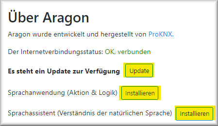

# ARAGON 2

***
# INHALT

[Allgemeines](#allgemeines)

[Eigenschaften](#eigenschaften)

[Aufstellung](#aufstellung)

[Mechanische und elektrische Installation](#mechanische)

[Inbetriebnahme Schritt für Schritt](#inbetriebnahme)

> [Konfigurationsoberfläche Aragon Master](#verbindung)

> [Einstellung der Sprache](#sprache)

> [Einstellung des Gateways](#gateway)

> [Update](#update)

> [Kofiguration des Gateways](#konfiggate)

> [Kofiguration der Satelliten](#konfigsat)

[Konfiguration für SONOS](#sonos)

[Anhang 1: Server und Gateways](#Anhang1)

> [proServ by ProKNX](#proServ)

> [X1 by Gira](#x1)

> [Homeserver by Gira](#homeserver)

> [all-KNX](#allknx)

> [SVS by Jung](#svs)

[Anhang 2: Was verstanden wird](#Anhang2)

> [Lichtbedienung](#lights)

> [Jalousiebedienung](#shutter)

> [Szenen](#scenes)

[Anhang 3: Hilfreiche Einstellungen](#Anhang3)

> [Globale Befehle deaktivieren](#globalcmd)

> [Funktionen auf die Blacklist setzen](#blacklist)

> [Verwendung von AV Control](#av-control)

***

<h1 id="allgemeines">Allgemeines</h1>

## Beschreibung

**Aragon** ist das erste KI gestützte Sprachsteuerungssystem, das ohne Internetverbindung funktioniert. Die Spracherkennung läuft auf dem Gerät – es wird nichts übertragen oder aufgezeichnet.

**Deine Privatsphäre ist garantiert**

Eine Aragon-Installation besteht aus einem (und nur einem) **Master** sowie **1 – 10 Satelliten**. Der Master ist obligatorisch und für die meisten Aufgaben zuständig, z.B. für das Verstehen von Sprachbefehlen und die Interaktion mit dem Hausautomatisierungssystem. Der Master arbeitet mit einem oder mehreren Satelliten zusammen. Den Satelliten gibt es in zwei Versionen:
- Satellite2 WL 
im Tischgehäuse mit RJ45 Anschluss oder Wi-Fi sowie Stromversorgung über 5V USB Steckernetzteil
- Satellite2 PoE
im Schalterdosenformat mit PoE Anschluss. Er wird mit einer 55x55mm Lautsprecherfront aber ohne Rahmen geliefert. Es stehen drei Farben zur Verfügung, Weiß, Schwarz oder Aluminium. LS Front für LS990 und LS-Zero ebenfalls möglich, bitte separat anfragen.

Jede Kombination aus WL und PoE Satellite ist möglich. Alle Aragon-Geräte müssen im selben Netzwerk installiert sein.
***

<h1 id="eigenschaften">Eigenschaften</h1>

## Privatsphäre

- Das Offline Sprachsteuerungssystem funktioniert auch ohne Internetverbindung. Was zu Hause gesagt wird, bleibt zu Hause
- Das Gesprochene wird weder übertragen noch aufgezeichnet
- Die Spracherkennung und Auswertung läuft auf dem Gerät
- Kein Internetkonto, kein „Skill“ muss aktiviert werden

## Flexibilität

- Vollständig anpassbar. Persönliche Wörter und Sätze können vom Assistenten leicht gelernt und verstanden werden
- Befehle können in tausenden Varianten formuliert werden
- ProKNX kann spezielle Kundenbedürfnisse im Sprachschatz berücksichtigen
- Das System ist interoperabel und kann mit anderen Systemen zusammenarbeiten

***

<h1 id="aufstellung">Aufstellung</h1>

Für den Installationsort der ARAGON Satelliten sind folgende Punkte zu beachten:
- Es sollte sich kein Lautsprecher in unmittelbarer Nähe befinden (nicht näher als 2m)
- Bei Verwendung von mehreren Aragon Satelliten ist der Abstand zueinander möglichst groß zu wählen, damit ein ansprechen von gleichzeitig zwei Geräten vermieden wird. 
- Die Verwendung von mehreren Geräten in einem Raum ist möglich, sollte vorher jedoch mit uns (ProKNX) abgestimmt werden. 
- Der Abstand zum Sprechenden kann in leiser Umgebung durchaus mehr als 7m betragen. Somit werden Räume mit einer Länge von 15m mit einem Gerät abgedeckt, sofern dies mittig angeordnet wird.
- Umgebungsgeräusche beeinträchtigen das Verstehen. Störend sind insbesondere gleichzeitige Sprecher.
- Es ist möglich, Mediengeräte nach Erkennen des Wakewords stumm zu schalten. Dazu bieten wir im NodeRed Flow eine Funktion an. Sonos Lautsprecher werden automatisch stumm geschaltet, sofern der Installationsraum identisch mit der SONOS Zone gewählt wird.

***

<h1 id="mechanische">Mechanische und elektrische Installation</h1>

## Aragon Master 

(Art. Nr. 139)

ARAGON Master ist für den Einbau in einen Netzwerkschrank vorgesehen. Er muss mit 5VDC versorgt werden, das Netzteil (im Lieferumfang enthalten) liefert einen maximalen Strom von 3A und wird mit dem USB-C-Anschluss des Masters verbunden. Außerdem muss eine Netzwerkverbindung mit dem RJ45-Ausgang hergestellt werden, der als "LAN" bezeichnet wird.

## Aragon Satellite2 WL 

(Art. Nr. 185)

Aragon Satellite2 WL kann als Tischgerät aufgestellt werden. Alternativ kann es auch mithilfe der Adapterplatte an die Wand oder Decke geschraubt werden. 
Lösen Sie die Adapterplatte vom Gerät, indem Sie diese im Uhrzeigersinn drehen. 
Bei Aufstellung als Tischgerät können jetzt die vier mitgelieferten Gummifüße in die Vertiefungen der Verschraubungen gesteckt werden.
Achten Sie bei der Wahl des Aufstellungsortes darauf, dass sich keine Lautsprecher in unmittelbarer Nähe befinden (nicht näher als 2 m). Bei der Verwendung mehrerer ARAGON-Geräte sollte der Abstand zwischen diesen so groß wie möglich gewählt werden, damit nicht zwei Geräte gleichzeitig das Aktivierungswort verstehen.

## Aragon Satellite2 PoE 

(Art. Nr. 184)

Bei der Wahl des Einbauortes ist zu beachten, dass sich möglichst kein Lautsprecher in unmittelbarer Nähe befindet (nicht näher als 2m). Bei Verwendung von mehreren Aragon Satelliten ist der Abstand zueinander möglichst groß zu wählen, damit ein Ansprechen von gleichzeitig zwei Geräten vermieden wird. Ein sehr gut geeigneter Einbauort ist vielfach die Mitte der Zimmerdecke, da der Abstand zum Sprechenden in der Regel klein ist. Direkt neben der Zimmertür (z.B. neben dem Lichtschalter) ist dagegen oft nicht zu empfehlen, da dann bei offener Tür der ARAGON des Nachbarzimmers auch mit dem Wakewort aktiviert werden könnte.
Das Gerät wird mittels Schraubklemmen an ein CAT5, CAT6 oder CAT7 angeschlossen. Der Farbcode der Bezeichnungen entspricht wie folgt:

> 

Die Klemme X ist nicht verwendet. 
Der Aragon wird über den einfachen PoE Standard betrieben, also IEEE 802.3af mit 48VDC / ca. 13W nutzbare Leistung. Die Leistungsaufnahme beträgt ca. 10W.

***

<h1 id="inbetriebnahme">Inbetriebnahme Schritt für Schritt</h1>

<h2 id="verbindung">Konfigurationsoberfläche Aragon Master</h2>

Das Starten des Aragon Master dauert etwa 2 Minuten. Es genügt dazu die Betriebsspannung anzulegen. Danach kann man ihn mittels Browser (Firefox, Chrome...) im Netzwerk finden, indem man die Adresse <http://find.heyaragon.com> eingibt. Im Eingabefeld des sich öffnenden Fensters muss das Subnetz des Netzwerks angegeben werden, z.B.  «192.168.1.»
Nach kurzer Zeit wird der Link (die IP- Adresse) des Aragon Master angezeigt, der einfach angeklickt werden kann. Eine spezielle Portangabe ist nicht erforderlich, da der Master über Port 80 erreicht wird.
Das Fenster der Master Konfigurationsoberfläche ermöglicht die Inbetriebnahme Schritt für Schritt. Zunächst sind jedoch Voreinstellungen vorzunehmen, die insbesondere die Benutzersprache und das verwendete Gateway zur Prozessankopplung betreffen. Auch wird empfohlen, zu diesem Zeitpunkt Systemupdates durchzuführen. 
Diese Voreinstellungen sind über diverse Menüpunkte dieser Seite direkt zu erreichen:

<h2 id="sprache">Einstellung der Sprache</h2>

Bitte stellen Sie als erstes sicher, dass die Gerätesprache richtig eingestellt wird (Menüpunkt „SPRACHE“)
 
> **Achtung:** Die hier eingestellte Sprache ändert nicht nur die Sprache der angezeigten Benutzeroberfläche sondern wirkt sich auch auf ein Update und die Aktualisierung der Systemsoftware aus. 
Bitte achten Sie auch darauf, dass eine eventuell aktivierte automatische Übersetzung des Browserfensters in dem von Ihnen verwendeten Browsers deaktiviert ist.

<h2 id="gateway">Einstellung des Gateways</h2>

Aragon erwartet die Definition eines Standardgateways, über welches es mit der Gebäudeautomation arbeitet. Das aktuell eingestellte Gateway ist auf dem ersten Bild der  Konfigurationsseite zu sehen, zB:

Sollte dieses Gateway nicht mit dem in Ihrer Installation verwendeten Gerät übereinstimmen, stellen Sie bitte das korrekte Gateway für Ihren Aragon ein.  Gehen Sie dazu auf den Menüpunkt „ÜBER“
Hier finden Sie die Zeile:

Das sich daraufhin öffnende Fenster ermöglicht die Installation eines der von uns unterstützten Gateways, bzw. Servers. Eine Auflistung der Server, deren Beschreibung und die jeweils unterstützten Funktionen sind im [Anhang 1: Server und Gateways](#Anhang1) beschrieben.

<h2 id="update">Update</h2>

Der Menüpunkt „ÜBER“ ermöglicht ebenso ein Update verschiedener Pakete des Aragon Masters durchzuführen.
Wenn nicht anders vereinbart empfehlen wir, die folgenden drei Updatevorgänge durchzuführen:

**1. Update Aragon System Software**
Das erste der hier genannten drei Updates aktualisiert die Systemsoftware von Aragon Master. Dies betifft die folgenden hier genannaten Versionen:

**2. Update / Installation Sprachanwendung**
Diese Schaltfläche installiert, bzw aktualisiert den NodeRed Flow „ARAGON V2,0“ welcher für den Betrieb von Aragon zwingend erforderlich ist. Er übernimmt neben der Kommunikation mit dem entsprechenden Gateway (Datenbeschaffung, Adressierung der Datenunkte…) auch die Analyse des erkannten Befehls und vieles mehr.

> **Achtung:** Sollten Sie Änderungen in diesem Flow vorgenommen haben, werden diese gelöscht, und der Standard wieder hergegestellt. Falls Sie Ihre Änderungen beibehalten wollen, müssen diese vorher manuell gesichert werden.

Eine Versionskontrolle ist direkt in einer der Gruppierungen dieses Hauptflows ersichtlich:

**3. Update / Installation Sprachassistent**

Der dritte Eintrag installiert den Sprachassistenten. Dieser legt fest, wie die verstandenen Worte interprteiert werden sollen.
> **Achtung:** Der Assistent wird abhängig der jeweile eingestellten Sprache der Bedienoberfläche installiert.

Sollten Änderungen im Verstehen bestimmter Satzstellungen gewünscht werden, können diese uns mitgeteilt werden. Nach Anpassung von unserer Seite wird durch Installation des geänderten Assistenten diese dann aktiviert.

<h2 id="konfiggate">Kofiguration des Gateways</h2>

- Der Dialog **„Gateway Konfiguration“** stellt sich je nach eingestelltem Gateway unterschiedlich dar. Details hierzu sind im [Anhang 1: Server und Gateways](#Anhang1) für jedes Gateway separat aufgeführt.
Die ersten beiden Häkchen müssen grün werden. Damit wird angezeigt, dass die Verbindung zwischen Aragon Master und Gateway korrekt initialisiert ist, und die Kommunikation besteht.

- Die Schaltfläche **„Stimme“** bietet über einen Dialog diverse Stimmen an, deren Sprachausgabe offline über eine interne TTS erzeugt werden. 
    > **Achtung:** Das Erzeugen der Sprachdatei ist sehr rechenintensiv. Als Faustformel kann man davon ausgehen, dass die Rechenzeit ein drittel der Dauer des gesprochenen Textes ausmacht.

- Das **Trainieren neuer Wörter** ist nach jeder Änderung der Konfiguration der eingelesenen Daten über das Gateway erforderlich. Der "ASR" (Automatic Speech Recognition) muss mitgeteilt werden, welche Wôrter im Wörterbuch gelistet sind, die schliesslich nach einem ausgeführten Trainingslauf auch verstanden werden.

<h2 id="konfigsat">Kofiguration der Satelliten</h2>

Nach Betätigung der Schaltfläche **"Satellitensuche"** werden innerhalb kurzer Zeit im darunterliegenden Pull-down Menü die IP Adressen der gefundenen Satelliten angezeigt.
Jetzt eine der Adressen auswählen und die Schaltfläche **"...mehr dazu"** betätigen.

- Bei Betätigung der Schaltfläche **"Testsignal ausgeben"** wird der Satellite mit der angezeigten IP Adresse einen Ton ausgeben.
- Jetzt in der Zeile **"Raum"** den entsprechenden  Raum auswählen, wo dieser Aragon installiert ist.
- Mit der Einstellung **"Empfindlichkeit"** lässt sich die Aktivierungsempfindlichkeit des Aktivierungswortes einstellen. Eine kleinere Empfindlichkeit bedeutet dass Aragon nicht so leicht aufgeweckt wird, und das Aktivierungswort sehr genau gesprochen werden muss.
- Das verbesserte  **"Wakeword System"** ermöglicht insbesondere eine grössere Auswahl an Aktivierungsworten
- Beim ausgewählten **"Wakeword"** sollte die angegebene Sprache der ausgewählten Sprache entsprechen, da Aktivierungsörter nur erkannt werden, wenn sie in der entsprechenden Sprache korrekt ausgesprochen werden. Die Satelliten können durchaus mit unterschiedlichen Aktivierungswörtern konfiguriert werden.
- Die Schaltfäche **"Wi-Fi"** ist nur bei einem Aragon WL aktiv. Im sich öffnenden Dialog kann aus der Liste der Wi-Fi SSID der entsprechende Zugangspunkt ausgewählt werden. Nach Eingabe des Wi-Fi Passwortes wird die Verbindung hergestellt und das Netzwerkkabel kann abgesteckt werden.
    > **Achtung:** Es wird nur 2,4 Ghz Wi-Fi unterstützt

    > Im Namen der SSID dürfen keine Sonderzeichen und keine Leerzeichen enthalten sein

    > Nach dem Einbuchen in das Wi-Fi Netzwerk erhält der Satellite eine neu IP Adresse

- **"Öffne die App"** öffnet eines neues Browserfenster mit der IP Adresse des Satelliten
- **"Starte die App neu"** startet die Applikation auf dem Satelliten neu
- **"Starte neu"** führt einen Neustart des Satelliten durch. 
- **"Ausschalten"** fährt den Satelliten runter und schaltet ihn aus. Ein Neustart ist nur durch einen Power-cycle möglich.
- **"Aktualisierung"** führt ein Update des Satelliten durch
- **"Wakewords erhalten"** lädt die aktuelle Sammlung an Wakewords auf des Gerät. 
- Der **"Audio-Test"** ermöglicht insbesondere einen Test des Mikrofons.
- Die **"DeepFilterNet-Rauschunterdrückung"** ist ein leistungsfähiger, digitaler Filer, der insbesondere Umgebungsgeräusche wirksam ausblenden kann. "Fremnde Stimmen" können nur schlecht eliminiert werden, da sie von den Nutzdaten nicht gut unterschieden werden können. Bei geringen Umgebungsgeräuschen ist der Filter nicht zu aktivieren. 

***

<h1 id="sonos">Konfiguration für SONOS</h1>

Die Einbindung eines SONOS Musiksystems erfolgt, indem **der Name der SONOS Zone jeweils identisch zum Namen des Raumes eines Satelliten festgelegt wird**.

Anschliessend werden folgende Funktionalitäten ermöglicht:

> **Bei Erkennen des Aktivierungswortes wird die SONOS Zone gemutet**
Das hat den Vorteil, dass anschliessend der gesprochene Befehl deutlich besser von ARAGON verstanden wird, da die Umgebungsgeräusche verringert sind

> **Es können Playlisten, Musiktitel und Radiostationen per Name gestartet werden**
Diese Funktion erfordert allerdings, dass die entsprechenden Musikstücke bzw Listen oder Stationen als SONOS Favoriten gespeichert werden. Direkt in der SONOS App ist es möglich, diesen Favoriten einen eigenen Namen zu vergeben (am besten in Deutsch), damit sie von ARAGON leichter verstanden werden. Nach dem Festlegen der Favoriten ist ein Trainingslauf der Worte durchzuführen.

> **Die Sprachausgabe der ARAGON Satelliten lässt sich auf die jeweilige SONOS Zone umleiten** 
auf Anfrage

Funktionen:

- **Musik starten**
*spiele Musik im Wohnzimmer*, *schalte das Radio in der Küche ein*, *mach "meine Musik" an* (mit dem Favoritentitel als "meine Musik"), *spiele irgendetwas*

- **Musik anhalten**
*schalte die Musik aus*, *Radio ausschalten*, *stop die Musik in der Küche*

- **Lautstärke einstellen**
*mach die Musik lauter*, *dreh die lautstärke runter*, *mach es etwas leiser*, *radio in der küche leiserstellen*, *stell die lautstärke im wohnzimmer auf 30%*

- **Titelsprung**
Der Titelsprung funkioniert nur bei laufender Playlist
*nächster Titel*, *nächstes Lied spielen*, *den folgenden Titel spielen*, *spiele den letzten Titel*, *das letzte Stück wiederholen*

- **Shazam**
*wie heisst der Song*, *wie ist der Name des Sängers*

***
***

<h1 id="Anhang1">Anhang 1: Server und Gateways</h1>

| Gateway | Beschreibung |
| ------ | ------ |
|[proServ by ProKNX](#proServ)|Ein Gateway, welches die gesamte Konfiguration der Sprachsteuerung über die ETS ermöglicht. Bedienung der KNX Installation über App und Sprache kann somit allein über eine ETS Konfiguration erfolgen|
|[X1 by Gira](#x1)|Es wird die Konfiguration eines im Netzwerk zugänglichen Gira X1 ausgelesen und kann mit Sprache bedient werden|
|[Homeserver by Gira](#homeserver)|Es wird die Konfiguration eines im Netzwerk zugänglichen Gira Homeservers (ab Vers. 4.10) mit konfiguriertem Quadclient ausgelesen und kann mit Sprache bedient werden|
|Philips HUE|Die Gebäude- und Funktionsstruktur einer HUE Bridge wird ausgelesen und kann per Sprache bedient werden|
|KNX IoT|Jedes Gerät, welches das KNX 3rd Party IoT Protokoll unterstützt, kann ausgelesen und bedient werden|
|[all-KNX](#allknx)|Sollte es in Ihrer Installation keinen der hier augelisteteten KNX-Server geben, kann die Kommunikation zwischen Aragon und dem KNX Bus auch mit einer Standard KNXNet/IP Schnittstelle erfolgen|
|Generic Gateway|Ermöglicht selbst die Kommunikation zwischen Aragon anderen Geräten entsprechend einer Regel (RestfulAPI, http Befehle, …) festzulegen|
|YOUVI by PEAKnx|Unterstützt die Bedienung der YOUVI Visualisierung per Sprache|
|[SVS by Jung](#svs)|Unterstützt die Bedienung des Smart Visu Servers von Jung per Sprache|
|LUXORliving by Theben|Unterstützt die Bedienung und die Abfrage einer LUXORliving Installation von Theben per Sprache (KNX Installation ganz ohne ETS)|
|Option ENOCEAN|Diese Option ermöglicht zusätzlich zu einem der oben festgelegten Standard Gateways auch die Verwendung von Sensoren und Aktoren, die den Enocean Standard unterstützen|

***

<h2 id="proServ">proServ by ProKNX</h2>

Wir gehen davon aus, dass vor Inbetriebnahme der Sprachsteuerung der proServ zur Visualisierung bereits konfiguriert und getestet wurde. Es ist zu beachten, dass nicht alle vom proServ angebotenen Funktionen auch für die Sprachsteuerung und -abfrage verwendet werden können. Hier eine Auflistung der möglichen Funktionen:

- **Schalten**
Funktion wird zum Schalten für Licht interpretiert (z.B. *"schalte das Licht im Wohnzimmer ein/aus"*). 

    > **Hinweis:** - Der Name des Lichtes wird exklusiv für die ganze Installation erkannt, d.h. man muss den Raumnamen nicht dazusagen, sofern es das Gerät nur einmal in der Installation gibt.

    > **Achtung:** Diese Funktion nicht verwenden, sofern Aggregate oder schaltbare Steckdosen bedient werden sollen, da diese dann mit dem Befehl "Schalte das Licht ein/aus" ebenfalls ein/ausgeschaltet würden. Hierzu die Funktion "AUX" verwenden!

- **Dimmen**
Funktion wird für das Dimmen des Lichts verwendet. Der Sprachbefehl ermöglicht *schalten*, *relatives dimmen* (z.B. *"mach es heller"*), *absolutes dimmen auf einen bestimmten Wert* (z.B. *"stelle das Licht auf 50%"*), und *Abfragen des Zustandes* (z.B. *"wie ist das Licht?"*). 

    > **Hinweis:** - Der Name des Lichtes wird exklusiv für die ganze Installation erkannt, d.h. man muss den Raumnamen nicht dazusagen, sofern es das Gerät nur einmal in der Installation gibt.

- **Jalousie mit Byte Rückmeldung**
Dies ist die einzige Funktion, welche die Steuerung und -abfrage einer Jalousie per Sprache ermöglicht. Die Funktion setzt voraus, dass der Aktor für die Positionierung und die Rückmeldung der Position konfiguriert wurde! Die Kommunikationsobjekte für Start und Stop werden für die Sprache nicht verwendet.

- **AUX - Schalten - umschalten**
Der Befehl ermöglicht die identischen Sprachbefehle wie der Befehl "Schalten". Der grosse Unterschied liegt allerdings darin, dass diese Funktion nicht mit dem Oberbegriff "Licht" interpretiert wird. Beispiel: *"Schalte das Kinderzimmer aus"* wird alle Funktionen *"Schalten"* und *"Dimmen"* ausschalten, nicht jedoch eine AUX Funktion!

- **Status - 2 Bytes Gleitkommawert**
Diese Funktion ermöglicht die Abfrage des Wertes per Sprache. Die angegebene Einheit wird dabei ebenfalls angesagt. Eine mögliche Abfrage wäre: *"Wie ist der Status der Luftfeuchte?"*, oder *"wie ist die Temperatur?"*

- **Status - 4 Bytes vorzeichenlos**
Diese Funktion ermöglicht die Abfrage des Wertes per Sprache. Die angegebene Einheit wird dabei ebenfalls angesagt. Eine mögliche Abfrage wäre: *"Wie ist der Status des Wasserzähler?"*

- **Status - 4 Bytes mit Vorzeichen**
Diese Funktion ermöglicht die Abfrage des Wertes per Sprache. Die angegebene Einheit wird dabei ebenfalls angesagt. Eine mögliche Abfrage wäre: *"Wie ist der Energieverbrauch?"*

- **Status - 4 Bytes Gleitkommawert**
Diese Funktion ermöglicht die Abfrage des Wertes per Sprache. Die angegebene Einheit wird dabei ebenfalls angesagt. Eine mögliche Abfrage wäre: *"Wie ist der Status der Stromstärke?"*

- **RTR mit 1Bit Betriebsmodus**
Dies ist die einzige Funktion, welche die Steuerung und -abfrage eines Raumtemperaturreglers per Sprache ermöglicht. Unabhängig vom festgelegten Namen der Funktion kann abgefragt werden *"wie ist der Thermostat"* oder *"wie ist die Temperatur"*. Als Antwort wird sowohl Ist- wie auch die augenblickliche Solltemperatur angesagt.Ebenso kann die Solltemperatur eingestellt werden, sowohl absolut wie auch relativ (z.B. *"erhöhe die Temperatur ein wenig"* oder *"stelle den Thermostat auf 21 grad ein"*)

- **Szenen**
...sind sehr leistungsfähige Funktionen. Sie ermöglichen die Zuordnung einer Szenennummer zu einem Szenennamen. Bei gesprochenem Szenenname wird die entsprechende Nummer (KNX konform "-1") auf den Bus geschrieben. Es ist kein gesprochener "Zusatz" erforderlich, es genügt den Namen wie festgelegt auszusprechen (z.B. *"Hole den Aufzug"*, *"aktiviere gelb"* oder *"gute Nacht"*)

> **Achtung:** Nach Änderung der Konfiguration des proServ über die ETS müssen die neuen Daten vom ARAGON Master ausgelesen werden, und die Wörter anschliessend "trainiert" werden. Dieser Vorgang wird durch einen Neustart von NodeRed ausgelöst **(im Menü NODE-RED anzuwählen: Reset Node-Red -> Neustart)**. Dies dauert ca. 90 Sekunden.

***

<h2 id="x1">X1 by Gira</h2>

**Vorbereitungen am X1:**
- Im **Gira Projekt Assistenten** (GPA) ist in der Benutzerverwaltung ein "fester Benutzer" mit dem Namen "Administrator" und der Rolle "Administrator" anzulegen. 

- Da **Sonderzeichen** nicht gesprochen werden, müssen diese im GPA entfernt werden. Dazu gehören insbesondere Klammern, Punkte, Gedankenstriche und Schrägstriche. Umlaute sind möglich.
- **Abkürzungen** vermeiden, da diese per Sprache nicht ausgesprochen werden (z.B. statt "HWR" -> "Hauswirtschaftsraum") 
- **Aufzählungen** vemeiden (statt "Kinderzimmer 1", Kinderzimmer 2"... besser "Max", "Moritz" verwenden). Zahlen ausschreiben (Bad 1, Bad 2 -> "Bad eins", "Bad zwei")

ARAGON Master erst nach einem konfigurierten GIRA X1 im Netzwerk anschliessen. 
Nach ca. 2 Minuten Hochlauf kann ARAGON Master im Netzwerk mittels Browser gesucht werden: http://find.heyaragon.com. 

Die Konfigurationsoberfläche wird über die gefundene IP-Adresse erreicht.

Die Schaltfläche "Gateway Konfiguration" öffnet einen Dialog, der die Eingabe der IP-Adresse des X1 ermöglicht. Bei erstmaliger Inbetriebnahme findet Aragon Master diese Adresse selbstständig.
Im gleichen Fenster ist das im GPA festgelegte Administrator Passwort einzugeben.

Nach dem Schliessen dieses Dialogs versucht Aragon Master eine Verbindung zum Gira X1 aufzubauen. Das Häkchen "Verbindungsstatus" sollte jetzt grün werden.

**Folgende Funktionen** des X1 werden für die Steuerung und Abfrage per Sprache unterstützt:

Funktion wird zum Schalten für Licht interpretiert (z.B. *"schalte das Licht im Wohnzimmer ein/aus"*). 

> **Hinweis:** - Der Name des Lichtes wird exklusiv für die ganze Installation erkannt, d.h. man muss den Raumnamen nicht dazusagen, sofern es das Gerät nur einmal in der Installation gibt.

> **Achtung:** Diese Funktion nicht verwenden, sofern Aggregate oder schaltbare Steckdosen bedient werden sollen, da diese dann mit dem Befehl "Schalte das Licht ein/aus" ebenfalls ein/ausgeschaltet würden. Hierzu die Funktion **"Taster"** verwenden!

Funktion wird für das Dimmen des Lichts verwendet. Der Sprachbefehl ermöglicht *schalten*, *relatives dimmen* (z.B. *"mach es heller"*), *absolutes dimmen auf einen bestimmten Wert* (z.B. *"stelle das Licht auf 50%"*), und *Abfragen des Zustandes* (z.B. *"wie ist das Licht?"*). 

> **Hinweis:** - Der Name des Lichtes wird exklusiv für die ganze Installation erkannt, d.h. man muss den Raumnamen nicht dazusagen, sofern es das Gerät nur einmal in der Installation gibt.

Der Befehl ermöglicht die identischen Sprachbefehle wie der Befehl "Schalten". Der grosse Unterschied liegt allerdings darin, dass diese Funktion nicht mit dem Oberbegriff "Licht" interpretiert wird. Beispiel: *"Schalte das Kinderzimmer aus"* wird alle Funktionen *"Schalten"* und *"Dimmen"* ausschalten, nicht jedoch eine "Taster" Funktion!

![shutter-x1-de.jpg]./_images/shutter-x1-de.jpg)

Diese Funktion ermöglicht die Steuerung und -abfrage einer Jalousie per Sprache. Die Funktion setzt voraus, dass der Aktor für die Positionierung und die Rückmeldung der Position konfiguriert wurde und die entsprechenden Gruppenadressen im GPA deklariert wurden! Die Adressen für Start und Stop werden für die Sprache nicht verwendet.

Diese Funktion ermöglicht die Steuerung und -abfrage eines Raumtemperaturreglers per Sprache. Unabhängig vom festgelegten Namen der Funktion kann abgefragt werden *"wie ist der Thermostat"* oder *"wie ist die Temperatur"*. Als Antwort wird sowohl Ist- wie auch die augenblickliche Solltemperatur angesagt.Ebenso kann die Solltemperatur eingestellt werden, sowohl absolut wie auch relativ (z.B. *"erhöhe die Temperatur ein wenig"* oder *"stelle den Thermostat auf 21 grad ein"*)

Szenen sind sehr leistungsfähige Funktionen. Sie ermöglichen die Zuordnung einer Szenennummer zu einem Szenennamen. Bei gesprochenem Szenenname wird die entsprechende Nummer (KNX konform "-1") auf den Bus geschrieben. Es ist kein gesprochener "Zusatz" erforderlich, es genügt den Namen wie festgelegt auszusprechen (z.B. *"Hole den Aufzug"*, *"aktiviere gelb"* oder *"gute Nacht"*)

Diese Funktion ermöglicht die Abfrage des Wertes per Sprache. Die angegebene Einheit wird dabei ebenfalls angesagt. Eine mögliche Abfrage wäre: *"Wie ist der Status der Luftfeuchte?"*, oder *"wie ist die Temperatur?"*. Es werden sowohl 2Byte float wie auch 4Byte float Werte unterstützt.

Diese Funktion ermöglicht die Abfrage des Wertes per Sprache. Die angegebene Einheit wird dabei ebenfalls angesagt. Eine mögliche Abfrage wäre: *"Wie ist der Energieverbrauch?"*

Diese Funktion ermöglicht die Abfrage des Wertes per Sprache. Die angegebene Einheit wird dabei ebenfalls angesagt. Eine mögliche Abfrage wäre: *"Wie ist der Status des Wasserzähler?"*

Mit dieser Funktion kann ein im GPA hinterlegter Vorgabewert auf eine Gruppenadresse gesendet werden. z.B. *"Aktiviere den Standardwert"*

> **Achtung:** Nach Änderung der Konfiguration des X1 müssen die neuen Daten vom ARAGON Master ausgelesen werden, und die Wörter anschliessend "trainiert" werden. Dieser Vorgang wird durch einen Neustart von NodeRed ausgelöst **(im Menü NODE-RED anzuwählen: Reset Node-Red -> Neustart)**. Dies dauert ca. 90 Sekunden.

> **Fehlermeldungen**
Falls eine Fehlermeldung wegen verwendeter Sonderzeichen erscheint, bitte diese in der GPA Konfiguration löschen. Die Schaltfläche "Trainieren neuer Wörter" im Bereich "Konfiguration des Gateways" ermöglicht eine Auflistung aller eingelesener Wörter. Hier können die Sonderzeichen schnell lokalisiert werden.

***

<h2 id="homeserver">Homeserver by Gira</h2>

**Vorbereitungen am Homeserver:**
- Im **Gira Experten** ist in der Benutzerverwaltung ein Benutzer mit dem Namen "Administrator"  anzulegen. 

Im **QuadClient** ist ein Benutzer für Aragon anzulegen. **Es ist die Option "Für IoT-Dienst bereitstellen" anzuwählen**

- Da **Sonderzeichen** nicht gesprochen werden, müssen diese im QC entfernt werden. Dazu gehören insbesondere Klammern, Punkte, Gedankenstriche und Schrägstriche. Umlaute sind möglich.
- **Abkürzungen** vermeiden, da diese per Sprache nicht ausgesprochen werden (z.B. statt "HWR" -> "Hauswirtschaftsraum") 
- **Aufzählungen** vemeiden (statt "Kinderzimmer 1", Kinderzimmer 2"... besser "Max", "Moritz" verwenden). Zahlen ausschreiben (Bad 1, Bad 2 -> "Bad eins", "Bad zwei")

ARAGON Master erst nach einem konfigurierten GIRA Homeserver im Netzwerk anschliessen. 
Nach ca. 2 Minuten Hochlauf kann ARAGON Master im Netzwerk mittels Browser gesucht werden: http://find.heyaragon.com. 

Die Konfigurationsoberfläche wird über die gefundene IP-Adresse erreicht.

Die Schaltfläche "Gateway Konfiguration" öffnet einen Dialog, der die Eingabe der IP-Adresse des Homeservers ermöglicht. 
Im gleichen Fenster ist das im Experten festgelegte Administrator Passwort einzugeben.

Nach dem Schliessen dieses Dialogs versucht Aragon Master eine Verbindung zum Gira Homeserver aufzubauen. Das Häkchen "Verbindungsstatus" sollte jetzt grün werden.

**Folgende Funktionsvorlagen** des QC werden für die Steuerung und Abfrage per Sprache unterstützt:

**Schalten plus**

Funktion wird zum Schalten für Licht interpretiert (z.B. *"schalte das Licht im Wohnzimmer ein/aus"*). 

> **Hinweis:** - Der Name des Lichtes wird exklusiv für die ganze Installation erkannt, d.h. man muss den Raumnamen nicht dazusagen, sofern es das Gerät nur einmal in der Installation gibt.

> **Achtung:** Diese Funktion nicht verwenden, sofern Aggregate oder schaltbare Steckdosen bedient werden sollen, da diese dann mit dem Befehl "Schalte das Licht ein/aus" ebenfalls ein/ausgeschaltet würden. Hierzu die Funktionsvorlage **"Taster plus"** verwenden!

**Dimmer plus**

Funktion wird für das Dimmen des Lichts verwendet. Der Sprachbefehl ermöglicht *schalten*, *relatives dimmen* (z.B. *"mach es heller"*), *absolutes dimmen auf einen bestimmten Wert* (z.B. *"stelle das Licht auf 50%"*), und *Abfragen des Zustandes* (z.B. *"wie ist das Licht?"*). 

> **Hinweis:** - Der Name des Lichtes wird exklusiv für die ganze Installation erkannt, d.h. man muss den Raumnamen nicht dazusagen, sofern es das Gerät nur einmal in der Installation gibt.

**Taster plus**

Der Befehl ermöglicht die identischen Sprachbefehle wie der Befehl "Schalten plus". Der grosse Unterschied liegt allerdings darin, dass diese Funktionsvorlage nicht mit dem Oberbegriff "Licht" interpretiert wird. Beispiel: *"Schalte das Kinderzimmer aus"* wird alle Funktionen *"Schalten plus"* und *"Dimmen plus"* ausschalten, nicht jedoch eine *"Taster plus"* Funktion!

**Rolladen Markise Dachfenster**

Diese Funktionsvorlage ermöglicht die Steuerung und -abfrage eines Rollladen per Sprache. Die Funktion setzt voraus, dass der Aktor für die Positionierung und die Rückmeldung der Position konfiguriert wurde und die entsprechenden Gruppenadressen deklariert wurden! Die Adressen für Start und Stop werden für die Sprache nicht verwendet.

**Heizung plus**

Diese Funktion ermöglicht die Steuerung und -abfrage eines Raumtemperaturreglers per Sprache. Unabhängig vom festgelegten Namen der Funktion kann abgefragt werden *"wie ist der Thermostat"* oder *"wie ist die Temperatur"*. Als Antwort wird sowohl Ist- wie auch die augenblickliche Solltemperatur angesagt. Ebenso kann die Solltemperatur eingestellt werden, sowohl absolut wie auch relativ (z.B. *"erhöhe die Temperatur ein wenig"* oder *"stelle den Thermostat auf 21 grad ein"*)

**Szene plus / Auslöser**

Szenen sind sehr leistungsfähige Funktionen. Sie ermöglichen die Zuordnung einer Szenennummer zu einem Szenennamen. Bei gesprochenem Szenenname wird die entsprechende Nummer (KNX konform "-1") auf den Bus geschrieben. Es ist kein gesprochener "Zusatz" erforderlich, es genügt den Namen wie festgelegt auszusprechen (z.B. *"Hole den Aufzug"*, *"aktiviere gelb"* oder *"gute Nacht"*)

**Sensor mit Grenzwert**

Diese Funktion ermöglicht die Abfrage des Wertes per Sprache. Die angegebene Einheit wird dabei ebenfalls angesagt. Eine mögliche Abfrage wäre: *"Wie ist der Status der Luftfeuchte?"*, oder *"wie ist die Temperatur?"*, *"Wie ist der Energieverbrauch?"*, *"Wie ist der Status des Wasserzähler?"*

> **Achtung:** Nach Änderung der Konfiguration des QC müssen die neuen Daten vom ARAGON Master ausgelesen werden, und die Wörter anschliessend "trainiert" werden. Dieser Vorgang wird durch einen Neustart von NodeRed ausgelöst **(im Menü NODE-RED anzuwählen: Reset Node-Red -> Neustart)**. Dies dauert ca. 90 Sekunden.

> **Fehlermeldungen**
Falls eine Fehlermeldung wegen verwendeter Sonderzeichen erscheint, bitte diese in der GPA Konfiguration löschen. Die Schaltfläche "Trainieren neuer Wörter" im Bereich "Konfiguration des Gateways" ermöglicht eine Auflistung aller eingelesener Wörter. Hier können die Sonderzeichen schnell lokalisiert werden.

***

<h2 id="allknx">all-KNX</h2>

ARAGON Master kann so konfiguriert werden, dass die Befehle und Abfragen über eine KNX Net/IP Schnittstelle über Gruppenadressen erfolgen.

Die Konfiguration ist in einer Datei im JSON Format hinterlegt. Diese Datei kann manuell erstellt werden und ist als Textdatei relativ gut lesbar. Wir nennen diese Datei GDF (Gateway Description File). 

**Anlegen oder Rücksichern der GDF Datei über Node-Red:**
Die GDF-Datei kann in der jeweiligen Sprache (Englisch, Deutsch und Französisch) über NodeRed angelegt oder die gesicherte Datei wieder rückgesichert werden. Dazu Node-Red mit **"öffne flow Editor"** und dem Benutzer **"user"** sowie dem auf Gerät aufgedruckten Passwort öffnen.

Durch Anwahl des Knotens **"German"** kann die JSON Datei lesbar angezeigt und auch editiert werden. 

Vorgenommene Änderungen werden durch die Schaltfläche **"Übernahme (deploy)"** oben rechts gespeichert.
Erst nach Betätigen der manuellen Injezierung (kleine blaue Fläche links im Knoten) ist die Datei aktiv und überschreibt die letzte Konfiguration. 

Die definierten Namen müssen nun noch trainiert werden. Dies erfolgt über den Menüpunkt **"Master" -> "Trainieren neuer Wörter"**.

> **Alternativ zu der oben beschriebenen Methode zur Erstellung der Konfiguration, die Kenntnisse in der JSON Syntax voraussetzt, empfehlen wir die Verwendung des GDF Editors.**

**Der GDF Editor**

Der GDF-Editor ist über das Node-Red Dashboard aufrufbar. Der Link findet sich unter dem Reiter **"NodeRed" -> "Öffne Dashboard"**.

Nach durchgeführten Änderungen müssen diese über die Schaltfläche **"SAVE AND APPLY"** am unteren Ende dieser Seite übernommen werden.

Die so definierten Namen müssen durch ARAGON noch trainiert werden. Dies erfolgt über den Menüpunkt **"Master" -> "Trainieren neuer Wörter"**. 

> **WICHTIG:** Diese Einstellungen bitte im Rahmen der Projektdokumentation dauerhaft sichern. Sie sind zwar "nicht flüchtig" im Gerät abgelegt, werden jedoch überschrieben, wenn die "Sprachanwendung (Aktion & Logik)" unter dem Reiter "Über" neu installiert wird. Die Datei kann gesichert werden über den Link **"Download active gatewayDescriptionFile.json"** der sich unterhalb der Schaltfläche **"SAVE AND APPLY"** befindet.

Der GDF Editor zeigt das Abbild der aktiven Variablendeklaration. Die gesicherte GDF-Datei kann in den "German" Knoten kopiert werden, und ermöglicht damit eine Rücksicherung.

**Datenpunkttypen für die Sprachsteuerung**

Der GDF Editor bietet folgende Datenpunkttypen an:

- **lights**
Dies sind geschaltene Geräte die auf den Namen Licht hören. Sie werden binär über ON/OFF bedient und haben ebenso eine binäre Rückmeldung (DPT 1.001)
- **dimmers**
Dies sind Geräte die auf den Namen Licht hören. Sie können binär geschaltet (DPT 1.001) oder über einen Wert gestellt werden (DPT 5.001). Die Rückmeldung genügt über den Wert (DPT 5.001).
- **blinds**
Dies sind Geräte die auf den Namen Rollladen hören. Sie können nur über einen Wert gestellt werden (DPT 5.001). Für die Rückmeldung ist ebenfalls ein Wert (DPT 5.001) erforderlich.
- **heating**
Dies sind Geräte die auf den Namen Thermostat hören. Drei Datenpunkte sind erforderlich: 
Current Temperature: Aktuelle Raumtemperatur, (DPT 9.001)
Target Temperature: Solltemperatur (DPT 9.001)
Actual Target Temperature: Aktuelle Solltemperatur (DPT 9.001)
- **scenes**
Szenen sind definiert über einen Namen, der bei Aktivierung einen Wert (scene number) von 1…64 (DPT 17.001) auf eine Gruppenadresse sendet.
- **sensor**
Sensoren können nur abgefragt werden. Hinterlegt wird neben der Gruppenadresse auch der DPT Typ und die Einheit. Zur Ermittlung des DPT Typs ist am besten die ETS heranzuziehen, da der Typ dort zur verwendeten Gruppenadresse angezeigt wird.
- **aux**
…. Sind Geräte oder Funktionen, die nicht auf den Namen Licht hören sollen und dennoch geschaltet werden können. Hier können binäre Datenpunkte als  DPT 1.001 angelegt werden, die über Schaltanweisungen (Ein/Aus) bedient werden. Es kann aber auch ein Umschalten des Datenpunktes ausgeschlossen werden, indem immer nur ein fester Wert (Ein bzw Aus) mit dem Befehl gesendet wird. Der Sprachbefehl erfolgt dann ähnlich einer Szene, die „aktiviert“ wird.

***

<h2 id="svs">SVS by Jung</h2>

Bitte die Inbetriebsetzung des SVS gemäß der Anleitung des Herstellers vornehmen. 

**Update von JUNG SVS**

Falls Ihr Jung SVS eine Firmware Versionsnummer von 1.2.1650 oder älter hat, müssen Sie diesen updaten.

1.	Sichern Sie die Konfiguration Ihres SVS in der JUNG Konfigurationsoberfläche (Settings -> System -> Backup)
2.	Gehen Sie zu den Einstellungen und wählen Sie die „Start“ Schaltfläche im Bereich „Update“
3.	-> Das Update dauert 5 - 10 Minuten
4.	-> Das System wird automatisch neu gestartet
5.	Gehen Sie zur Benutzerverwaltung
6.	Erstellen Sie mindestens einen Administrator
7.	**Aktivieren Sie das https-Protokoll** (ohne https kann keine Kommunikation zum SVS aufgenommen werden!)

ARAGON Master erst nach einem konfigurierten SVS im Netzwerk anschliessen. 
Nach ca. 2 Minuten Hochlauf kann ARAGON Master im Netzwerk mittels Browser gesucht werden: http://find.heyaragon.com. 

Die Konfigurationsoberfläche wird über die gefundene IP-Adresse erreicht.

Die Schaltfläche **"Gateway Konfiguration"** öffnet einen Dialog, der die Eingabe der IP-Adresse des SVS ermöglicht. Die Adresse wird bei Erstinbetriebnahme automatisch eingetragen sofern ein SVS im Netzwerk gefunden wird. 

Als **Passwort** bitte das „Administrator Passwort“ eingeben. Dieses wird über die JUNG Projektier Software im Bereich „Benutzerverwaltung“ festgelegt.

Es werden derzeit folgende **Funktionen** des SVS für die offline Sprachbefehle unterstützt:

- Switch/Dimmer
- Switch
- On/off (wird nicht als „Licht“ verarbeitet, wird also bei Globalbefehlen wie „schalte das Licht im Raum aus“ nicht berücksichtigt)
- Dimmer
- Dimmer/switch
- Motor
- Roller/Shutter/Awning
- Venetian Blind (Slider + Button)
- Heating
- Base Setpoint
- Scene
- Activate scene
- Value/State
- Display 2Byte float
- Display 2Byte lux
- Display 4Byte float
- Display 4Byte unsigned integer
- Display 4Byte signed integer
- Value transmitter
- Send 1Byte (0-100%)

> Darauf achten, dass die Sprachsteuerung in der jeweiligen Funktion des SVS aktiviert wurde

**Fehlermeldungen**

Falls eine Fehlermeldung wegen verwendeter Sonderzeichen erscheint, bitte diese in der Konfiguration löschen. Keine Abkürzungen in den Namen verwenden. Zahlen ausschreiben („Kinderzimmer 2“ -> „Kinderzimmer zwei“).

***
***

<h1 id="Anhang2">Anhang 2: Was verstanden wird</h1>

Die Sprache ermöglicht unterschiedliche Möglichkeiten einen Befehl auszudrücken. Das sogenannte NLU (Natural Language Understanding) ermöglicht, dass diese unterschiedlichen Satzstellungen und Ausdrucksweisen vom Rechner interpretiert werden können. 

Als Beispiel: Folgende Ausdrucksweisen haben alle das gleiche Ziel, und sind doch grundverschieden:

- *Schalte die Hängelampe ein*
- *Hängelampe einschalten*
- *Mach die Hängelampe an*
- *Dreh die Hängelampe auf*

Wenn das Gerät in einem bestimmten Raum bedient werden soll, erhöht sich die Vielfalt um mindestens Faktor 4, da der Raumname vor oder auch nach dem Gerät genannt werden kann. Weiterhin kann bei Verwendung von Dimmaktoren das Licht absolut und relaiv verstellt werden.

All diese Kombinationen sollen eindeutig verstanden werden!

Dazu werden die Befehle sogenannten INTENTs zugeordnet. Folgende Intents sind realisiert:

<h2 id="lights">Lichtbedienung</h2>

Bedienen einzelner Lichtkreise:
- *Schalte die/den/das {FUNKTION} in {ZONE} ein/aus* -> Es wird der Lichkreis mit dem Namen {FUNKTION} in dem Raum mit dem Namen {ZONE} bedient
- *Stelle die/den/das {FUNKTION} in {ZONE} auf 50%* -> Es wird der Lichkreis mit dem Namen {FUNKTION} in dem Raum mit dem Namen {ZONE} auf 50% eingestellt
- *Mach die/den/das {FUNKTION} heller* -> Es wird der Lichkreis mit dem Namen {FUNKTION} in der dem Satelliten zugeordneten Zone um 20% heller gestellt

Bedienung mehrerer Lichtkreise:
-	*Schalte das Licht ein/aus* -> Es werden alle Lichtkreise in der konfigurierten Zone des Satellite bedient
-	*Schalte das Licht in {ZONE} ein/aus* -> Es werden alle Lichtkreise in der genannten Zone bedient
-	*Schalte das Licht überall (oder "im ganzen Haus", "in der Wohnung") ein/aus*  -> Es die Lichtkreise in der gesamten Installetion bedient
-	*Mach das Licht heller* -> Es werden alle Lichtkreise in der konfigurierten Zone des Satellite um 20% heller gestellt
-	*Stell das Licht auf 50%* -> Es werden alle Lichtkreise in der konfigurierten Zone des Satellite auf 50% gestellt
-	*Schalte die {Zone} aus* -> Es werden alle Lichtkreise des entsprechenden Raumes ausgeschaltet

> **Unique Namenserkennung:** Beim Licht (und nur hier) wird die Namenserkennung auf die gesamte Installation ausgeweitet. Sollte der Name also unique sein, muss der Name des Raumes nicht genannt werden. Wenn es in der Installation jedoch mehrere Lichtkreise mit dem gleichen Namen geben, werden alle diese Lichtkreise bedient.

> **Wildcard**: Die Namen "Licht", "Beleuchtung", "Lampen" sind Platzhalter für alle Lichtfunktionen (geschaltet und gedimmt) im Raum bzw. im Haus. "Licht ein" sucht also alle Lichtkreise im Raum und schaltet diese ein. Es ist deshalb nicht sinnvoll einen Lichtkreis mit einem der Wildcard-Namen zu benennen, da er nicht einzeln angesprochen werden kann.

> **globale Befehle** können deaktiviert werden (siehe hier: [Globale Befehle deaktivieren](#globalcmd))

***

<h2 id="shutter">Jalousiebedienung</h2>

Bedienung einzelner Jalousien:

- *Öffne/Schliesse den Rollladen* -> Es wird der Behang mit dem Namen "Rollladen" in der dem Satelliten zugeordneten Zone bis in die jeweilige Endlage bewegt
- *Fahre die Markiese im Aussenbereich aus* -> Es wird der Behang mit dem Namen "Markiese" in der Zone "Aussenbereich" ausgefahren
- *Öffne/Schliesse die Jalousie ein wenig* -> Es wird der Behang mit dem Namen "Jalousie" in der dem Satelliten zugeordneten Zone um 20% geöffnet/geschlossen
- *Positioniere/fahre die/den/das {FUNKTION} in {ZONE} auf 20%* -> Es wird der angesprochene Behang  in dem festgelegten Raum auf 20% gestellt. (100% bedeutet vollständig geschlossen)

Bedienung mehrerer Jalousien:

- *Öffne/Schliesse die Rollladen*  -> Es werden alle als Behang definierten Funktionen in der dem Satelliten zugeordneten Zone bis in die jeweilige Endlage bewegt
- *Öffne/Schliesse die Jalousien im ganzen Haus* -> Es werden alle als Behang definierten Funktionen der ganzen Installation bis in die jeweilige Endlage bewegt
-	*Schliesse die {Zone}* -> Es werden alle als Behang definierten Funktionen des entsprechenden Raumes geschlossen

> **Wildcard**: Die Namen "Rollladen", "Jalousien", "Rollos" (nur in der Mehrzahl) sind Platzhalter für alle motorischen Antriebe im Raum bzw. im Haus. "Alle Rollladen hochfahren" sucht also alle Behang-Funktionen im Raum und fährt diese in die obere Endlage. Wenn es in einem Raum sowohl Rollladen als auch den motorisch angetriebenen Mückenschutz gibt, würden mit diesem Befehl beide Systeme geöffnet.

> **Türen, Tore, motorische Leinwände**: Diese Geräte werden mit den Wildcard Namen nicht angesprochen.

> **globale Befehle** können deaktiviert werden (siehe hier: [Globale Befehle deaktivieren](#globalcmd))

***

<h2 id="scenes">Szenen</h2>

Szenen sind universell einsetzbare Befehle. Es sind zu unterscheiden:
> **KNX Szenen**
Die betroffenen Mitglieder (Aktorkanäle) einer KNX Szene (auch Nebenstellenszene genannt) müssen bereits in der ETS konfiguriert werden.
Zur Laufzeit kann dann aber eingestellt werden, wie sich jeder Aktorkanal bei Aufruf einer Szenennummer zu verhalten hat. 
Bei den meisten Aktoren kann in den Aktorparametern auch festgelegt werden, ob ein Aktorkanal überhaupt von der Szenennummer betroffen ist, selbst wenn er der Gruppenadresse der Szene zugeordnet ist.

> [**Superszenen**](#vocalautomating)
Aragon bietet vier Superzenen an (hier eine Auflistung mit einigen Kommandoalternativen):

|Guten Morgen|Gute Nacht|Ich bin zu Hause|Ich verlasse das Haus|
|-----|-----|-----|-----|
|Morgen|Schlaf gut|Ich bin zurück|Auf Wiedersehen|
|Moin|Bis morgen|Wir sind wieder da|Bye bye|

**Superszenen** können sehr einfach (auch durch den Endanwender) editiert werden. Es genügt den von Aragon verstandenden Befehl **im Klartext in eine der Kommandozeilen aufzuschreiben**. Es ist auch möglich, Aragon nach Aufruf der Superszene einen **Text sprechen zu lassen**. Hierfür ist in der Kommandozeile der Text `SAY` dem vorzulesenden Text voranzustellen

> **Achtung**: Wenn die Verwendung von Superszenen aktiviert ist, haben diese Kommandos Vorrang zu gleichnamigen KNX Szenen.

**Deaktivierung von Superszenen:**

Viele KNX Applikationen verwenden bereits die Namen der Superszenen. Sofern die Superszenen dann deaktiviert werden sollen, nehmen Sie bitte folgende Modifikation im Main Flow unter NodeRed vor:

**Befehle für Szenen**
Ausgenommen der globalen Superszenen bezieht sich das Kommando der Szene immer auf den Raum, zu dem der Satellite konfiguriert wurde.
Ausserdem haben Szenen die Eigenschaft, dass der Szenenname allein ausgesprochen die Ausführung des Kommandos veranlasst. Dadurch lassen Sich auch ganz spezielle Kommandos generieren:

*Hol den Aufzug* vor dem Satelliten auf Stockwerk 1 würde zB die Szenennummer 1 auslösen

*Hol den Aufzug* vor dem Satelliten auf Stockwerk 2 würde zB die Szenennummer 2 auslösen

***
***

<h1 id="Anhang3">Anhang 3: Hilfreiche Einstellungen</h1>

<h2 id="globalcmd">Globale Befehle deaktivieren</h2>

Bei grossen Installationen (z.B. bei Einsatz eines Aragon Master für mehrere Wohneinheiten) kann es notwendig sein, globale Befehle zu deaktivieren.

Hierzu die folgende Gruppe in einen neuen Flow (Tab) kopieren und anschliessend den Wert des manuellen Inject Knotens auf "false" setzen. 

Jetzt noch das deploy ausführen!

***

<h2 id="blacklist">Funktionen auf die Blacklist setzen</h2>

Insbesondere in sehr grossen Installationen werden oft hunderte von Funktionen aus dem KNX Server ausgelesen. Viele von ihnen sind nicht für die Sprachbedienung vorgesehen oder dürfen nicht mit Sprache bedient werden.
Um diese für Aragon auszuschliessen, kann eine Blacklist angelegt werden, welche die Namen der nicht zu bedienenden Funktionen auflistet.

Im Aragon V2.0 Mainflow ist dazu folgende Gruppe angeboten:

Kopieren Sie diese Gruppe in einen neuen Flow und editieren Sie den Funktionsblock mit der JSON Datei.

***

<h2 id="av-control">Verwendung von AV Control</h2>

Die folgenden Funktionen ermöglicht sowohl TV als auch Audio in einer Zone zu steuern in der auch ARAGON aufgestellt ist. 

Im Main-Flow von NodeRed steht dazu eine Gruppe **"CUSTOM MEDIA CONTROL"** zur Verfügung, die am Besten in einen neuen Flow kopiert werden kann.

Folgende Befehle stehen für die Mediengeräte Steuerung zur Verfügung:

-	Erhöhe Lautstärke (relaiiv)
-	Verringere Lautstärke (relativ)
-	Stelle die Lautstärke ein (absolut, 0 – 100%)
-	AV Systemstart (Einschalten/Play)
-	AV Systemstop (Ausschalten/anhalten)
-	Nächster Titel/Kanal
-	Vorheriger Titel/Kanalwahl
-	Abfrage, was gespielt wird (nur SONOS)
-	Kanal-Titelwahl über Namen

Jetzt den Filter Knoten öffnen, und die Zeile 4 kommentieren, um ihn zu aktivieren.
