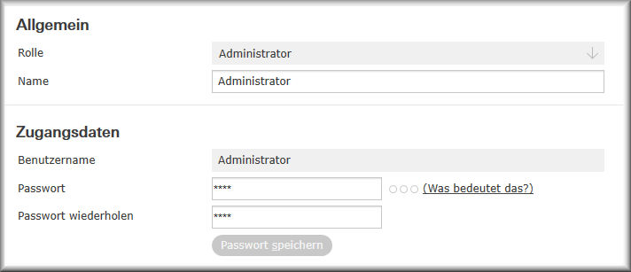

# ARAGON 2

***
# CONTENTS

[General](#general)

[Features](#features)

[Setup](#setup)

[Mechanical and Electrical Installation](#mechanical)

[Step-by-Step Commissioning](#commissioning)

> [Aragon Master Configuration Interface](#connection)

> [Language Setting](#language)

> [Gateway Setting](#gateway)

> [Update](#update)

> [Gateway Configuration](#gatewayconfig)

> [Satellite Configuration](#satelliteconfig)

[Configuration for SONOS](#sonos)

[Appendix 1: Server and Gateways](#appendix1)

> [proServ by ProKNX](#proserv)

> [X1 by Gira](#x1)

> [Homeserver by Gira](#homeserver)

> [all-KNX](#allknx)

> [SVS by Jung](#svs)

[Appendix 2: What is Understood](#appendix2)

> [Light Control](#lights)

> [Shutter Control](#shutter)

> [Scenes](#scenes)

[Appendix 3: Helpful Settings](#appendix3)

> [Disable Global Commands](#globalcmd)

> [Blacklist Functions](#blacklist)

> [Using AV Control](#av-control)

***

<h1 id="general">General</h1>

## Description

**Aragon** is the first AI-powered voice control system that works without an internet connection. The speech recognition runs on the device - nothing is transmitted or recorded.

**Your privacy is guaranteed**

An Aragon installation consists of one (and only one) **Master** and **1 - 10 Satellites**. The Master is mandatory and responsible for most tasks, such as understanding voice commands and interacting with the home automation system. The Master works together with one or more Satellites. There are two versions of the Satellite:
- Satellite2 WL
in a tabletop housing with RJ45 connection or Wi-Fi, and powered by a 5V USB power supply
- Satellite2 PoE
in a switch box format with PoE connection. It comes with a 55x55mm speaker front but without a frame. Three colors are available: White, Black, or Aluminum. LS front for LS990 and LS-Zero is also possible, please inquire separately.

Any combination of WL and PoE Satellite is possible. All Aragon devices must be installed in the same network.
***

<h1 id="features">Features</h1>

## Privacy

- The offline voice control system works even without an internet connection. What is said at home stays at home.
- Spoken words are neither transmitted nor recorded.
- Speech recognition and evaluation are done on the device.
- No internet account, no "skill" needs to be activated.

## Flexibility

- Fully customizable. Personal words and phrases can be easily learned and understood by the assistant.
- Commands can be formulated in thousands of variations.
- ProKNX can consider specific customer needs in the language repertoire.
- The system is interoperable and can work with other systems.

***

<h1 id="installation">Installation</h1>

The following points should be considered for the installation location of ARAGON Satellites:
- There should be no speaker in close proximity (no closer than 2m).
- When using multiple Aragon Satellites, the distance between them should be as large as possible to avoid triggering two devices simultaneously.
- The use of multiple devices in one room is possible but should be coordinated with us (ProKNX) beforehand.
- The distance to the speaker can be more than 7m in a quiet environment. Therefore, rooms with a length of 15m can be covered with one device if it is centrally positioned.
- Ambient noise affects understanding. Simultaneous speakers are particularly disturbing.
- It is possible to mute media devices after detecting the wake word. We provide a function for this in the NodeRed Flow. Sonos speakers are automatically muted if the installation room is the same as the SONOS Zone.

***

<h1 id="mechanical">Mechanical and Electrical Installation</h1>

## Aragon Master

(Art. No. 139)

ARAGON Master is intended for installation in a network cabinet. It needs to be powered with 5VDC, and the power supply (included in the package) provides a maximum current of 3A and is connected to the USB-C port of the Master. Additionally, a network connection needs to be established with the RJ45 output labeled as "LAN".

## Aragon Satellite2 WL

(Art. No. 185)

Aragon Satellite2 WL can be placed on a table. Alternatively, it can also be mounted on the wall or ceiling using the adapter plate. 
To detach the adapter plate from the device, rotate it clockwise. 
When placed on a table, the four supplied rubber feet can now be inserted into the recesses of the screw connections.
When choosing the installation location, make sure that there are no speakers nearby (no closer than 2m). When using multiple ARAGON devices, the distance between them should be as large as possible to avoid two devices understanding the wake word simultaneously.

## Aragon Satellite2 PoE

(Art. No. 184)

When choosing the installation location, make sure that there are no speakers nearby (no closer than 2m). When using multiple Aragon Satellites, the distance between them should be as large as possible to avoid triggering two devices simultaneously. A very suitable installation location is often the center of the ceiling, as the distance to the speaker is usually small. However, placing it directly next to the room door (e.g., next to the light switch) is often not recommended, as the ARAGON in the neighboring room could be activated with the wake word when the door is open.
The device is connected to a CAT5, CAT6, or CAT7 using screw terminals. The color code of the designations is as follows:

> 

Terminal X is not used. 
The Aragon is powered by the standard PoE, i.e., IEEE 802.3af with 48VDC / approximately 13W usable power. The power consumption is approximately 10W.

***

<h1 id="inbetriebnahme">Step-by-Step Setup</h1>

<h2 id="verbindung">Aragon Master Configuration Interface</h2>

Starting the Aragon Master takes about 2 minutes. Simply apply the operating voltage. After that, it can be found on the network using a browser (Firefox, Chrome...) by entering the address <http://find.heyaragon.com>. In the input field of the opening window, the subnet of the network must be specified, e.g., "192.168.1."
After a short time, the link (the IP address) of the Aragon Master will be displayed, which can be clicked on. A specific port specification is not required, as the Master is accessed via port 80.
The window of the Master configuration interface allows for step-by-step setup. However, some initial settings need to be made, particularly regarding the user language and the gateway used for process coupling. It is also recommended to perform system updates at this time. 
These initial settings can be accessed directly through various menu items on this page.

<h2 id="language">Language Setting</h2>

Please make sure to set the device language correctly (menu item "LANGUAGE").

> **Attention:** The language set here not only changes the language of the displayed user interface but also affects an update and the updating of the system software. 
Please also make sure that any activated automatic translation of the browser window in the browser you are using is deactivated.

<h2 id="gateway">Gateway Setting</h2>

Aragon expects the definition of a default gateway through which it works with building automation. The currently set gateway can be seen in the first image on the configuration page, for example:

If this gateway does not match the device used in your installation, please set the correct gateway for your Aragon. Go to the "ABOUT" menu item.
Here you will find the line:

The window that opens allows you to install one of the gateways or servers supported by us. A list of the servers, their description, and the supported functions are described in [Appendix 1: Servers and Gateways](#Appendix1).

<h2 id="update">Update</h2>

The "ABOUT" menu item also allows you to update various packages of the Aragon Masters.
Unless otherwise agreed, we recommend performing the following three update operations:

**1. Update Aragon System Software**
The first of the three updates mentioned here updates the system software of Aragon Master. This affects the following versions mentioned here:

**2. Update / Installation Language Application**
This button installs or updates the NodeRed Flow "ARAGON V2.0", which is essential for the operation of Aragon. It takes care of communication with the corresponding gateway (data acquisition, addressing of data points, etc.) as well as the analysis of the recognized command and much more.

> **Attention:** If you have made any changes to this flow, they will be deleted and the default settings will be restored. If you want to keep your changes, you must manually save them before.

A version control is directly visible in one of the groupings of this main flow:

**3. Update / Installation of Voice Assistant**

The third entry installs the voice assistant. It determines how the understood words should be interpreted.
> **Attention:** The assistant is installed depending on the language set in the user interface.

If you want to make changes to the understanding of certain sentence structures, you can inform us. After our adjustment, the installation of the modified assistant will activate it.

<h2 id="gatewayconfig">Configuration of the Gateway</h2>

- The **"Gateway Configuration"** dialog appears differently depending on the selected gateway. Details for each gateway are listed separately in [Appendix 1: Servers and Gateways](#Appendix1).
The first two checkboxes must turn green. This indicates that the connection between Aragon Master and the gateway is correctly initialized and communication is established.

- The **"Voice"** button offers various voices in a dialog, whose speech output is generated offline using an internal TTS (Text-to-Speech) system.
> **Attention:** Generating the speech file is very computationally intensive. As a rule of thumb, the processing time is estimated to be one-third of the duration of the spoken text.

- **Training new words** is required after any changes to the configuration of the data read through the gateway. The "ASR" (Automatic Speech Recognition) needs to be informed about which words are listed in the dictionary and will eventually be understood after a completed training run.

<h2 id="satelliteconfig">Configuration of the Satellites</h2>

After pressing the **"Satellite Search"** button, the IP addresses of the found satellites will be displayed in the dropdown menu below.
Now, select one of the addresses and press the **"...more about it"** button.

- Pressing the **"Output Test Signal"** button will make the satellite with the displayed IP address emit a sound.
- Now, select the corresponding **"Room"** in the line where this Aragon is installed.
- The **"Sensitivity"** setting allows you to adjust the activation sensitivity of the wake word. A lower sensitivity means that Aragon will not be easily awakened, and the wake word must be spoken very accurately.
- The improved **"Wake Word System"** allows for a greater selection of wake words.
- The selected **"Wake Word"** should match the specified language of the selected language, as wake words are only recognized when pronounced correctly in the corresponding language. The satellites can be configured with different wake words.
- The **"Wi-Fi"** button is only available for Aragon WL. In the dialog that opens, the corresponding access point can be selected from the list of Wi-Fi SSIDs. After entering the Wi-Fi password, the connection will be established, and the network cable can be unplugged.
    > **Attention:** Only 2.4 GHz Wi-Fi is supported.

    > The SSID name must not contain special characters or spaces.

    > After connecting to the Wi-Fi network, the satellite will receive a new IP address.

- **"Open the App"** opens a new browser window with the satellite's IP address.
- **"Restart the App"** restarts the application on the satellite.
- **"Restart"** performs a restart of the satellite.
- **"Turn Off"** shuts down the satellite. A restart is only possible through a power cycle.
- **"Update"** performs an update of the satellite.
- **"Get Wake Words"** loads the current collection of wake words onto the device.
- The **"Audio Test"** allows for testing the microphone, in particular.
- The **"DeepFilterNet Noise Reduction"** is a powerful digital filter that can effectively suppress ambient noise. "Foreign voices" cannot be eliminated well, as they cannot be well distinguished from the user's data. The filter should not be activated in low ambient noise conditions.

***

<h1 id="sonos">Configuration for SONOS</h1>

Integration of a SONOS music system is done by **setting the name of the SONOS Zone identical to the name of a satellite room**.

The following functionalities are then enabled:

> **When the activation word is detected, the SONOS Zone is muted**
This has the advantage that the spoken command is better understood by ARAGON afterwards, as the ambient noise is reduced.

> **Playlists, music tracks, and radio stations can be started by name**
However, this function requires that the corresponding music tracks, lists, or stations are saved as SONOS favorites. In the SONOS app, it is possible to assign a custom name to these favorites (preferably in German) to make them easier for ARAGON to understand. After setting the favorites, a training run of the words needs to be performed.

> **The voice output of the ARAGON satellites can be redirected to the respective SONOS Zone**
upon request

Functions:

- **Start music**
*play music in the living room*, *turn on the radio in the kitchen*, *play "my music"* (with the favorite title as "my music"), *play something*

- **Pause music**
*turn off the music*, *turn off the radio*, *stop the music in the kitchen*

- **Adjust volume**
*increase the volume of the music*, *turn the volume down*, *make it a bit quieter*, *lower the volume in the kitchen*, *set the volume in the living room to 30%*

- **Skip track**
Track skipping only works with a running playlist
*next track*, *play the next song*, *play the following track*, *play the last track*, *repeat the last piece*

- **Shazam**
*what is the name of the song*, *what is the name of the singer*

***
***

<h1 id="appendix1">Appendix 1: Servers and Gateways</h1>

| Gateway | Description |
| ------ | ------ |
|[proServ by ProKNX](#proServ)|A gateway that allows the entire configuration of voice control via ETS. Operation of the KNX installation via app and voice can thus be done solely through an ETS configuration|
|[X1 by Gira](#x1)|The configuration of a network-accessible Gira X1 is read out and can be operated with voice|
|[Homeserver by Gira](#homeserver)|The configuration of a network-accessible Gira Homeserver (from version 4.10) with a configured Quadclient is read out and can be operated with voice|
|Philips HUE|The building and functional structure of a HUE Bridge is read out and can be operated by voice|
|KNX IoT|Any device that supports the KNX 3rd Party IoT protocol can be read out and operated|
|[all-KNX](#allknx)|If there is no KNX server listed here in your installation, communication between Aragon and the KNX bus can also be done with a standard KNXNet/IP interface|
|Generic Gateway|Allows communication between Aragon and other devices to be defined according to a rule (RestfulAPI, http commands, etc.)|
|YOUVI by PEAKnx|Supports operation of the YOUVI visualization with voice|
|[SVS by Jung](#svs)|Supports operation of the Smart Visu Server by Jung with voice|
|LUXORliving by Theben|Supports operation and querying of a LUXORliving installation by Theben with voice (KNX installation without ETS)|
|Option ENOCEAN|This option allows the use of sensors and actuators that support the Enocean standard in addition to one of the standard gateways defined above|

***

## proServ by ProKNX

We assume that before starting the voice control, the proServ for visualization has already been configured and tested. It should be noted that not all functions offered by proServ can be used for voice control and querying. Here is a list of possible functions:

- **Switching**
This function is interpreted as switching the lights (e.g. "turn on/off the lights in the living room").

    > **Note:** - The name of the light is recognized exclusively for the entire installation, so you don't have to mention the room name if there is only one device in the installation.

    > **Caution:** Do not use this function if you want to operate aggregates or switchable sockets, as they would also be turned on/off with the command "Turn on/off the lights". Use the "AUX" function for this purpose!

- **Dimming**
This function is used for dimming the lights. The voice command allows for *switching*, *relative dimming* (e.g. "make it brighter"), *absolute dimming to a specific value* (e.g. "set the light to 50%"), and *querying the status* (e.g. "what is the light like?").

    > **Note:** - The name of the light is recognized exclusively for the entire installation, so you don't have to mention the room name if there is only one device in the installation.

- **Blind with Byte Feedback**
This is the only function that allows controlling and querying a blind via voice. The function assumes that the actuator for positioning and position feedback has been configured! The communication objects for start and stop are not used for voice control.

- **AUX - Switching - toggling**
This command allows the same voice commands as the "Switching" command. The big difference, however, is that this function is not interpreted with the general term "light". For example, "Turn off the children's room" will turn off all "Switching" and "Dimming" functions, but not an AUX function!

- **Status - 2 Byte floating-point value**
This function allows querying the value by voice. The specified unit is also announced. A possible query would be: "What is the humidity status?" or "What is the temperature?"

- **Status - 4 Byte unsigned**
This function allows querying the value by voice. The specified unit is also announced. A possible query would be: "What is the water meter status?"

- **Status - 4 Byte signed**
This function allows querying the value by voice. The specified unit is also announced. A possible query would be: "What is the energy consumption?"

- **Status - 4 Byte floating-point value**
This function allows querying the value by voice. The specified unit is also announced. A possible query would be: "What is the current status of the current?"

- **RTR with 1-bit operating mode**
This is the only function that allows controlling and querying a room temperature controller by voice. Regardless of the set function name, it can be queried as "What is the thermostat?" or "What is the temperature?" The response will include both the actual and the current set temperature. The set temperature can also be adjusted, either absolutely or relatively (e.g., "increase the temperature a bit" or "set the thermostat to 21 degrees").

- **Scenes**
...are very powerful functions. They allow assigning a scene number to a scene name. When the spoken scene name is recognized, the corresponding number (KNX compliant "-1") is written to the bus. No spoken "addition" is required, simply pronounce the name as defined (e.g., "Call the elevator", "activate yellow", or "good night").

> **Attention:** After changing the configuration of the proServ via ETS, the new data must be read from the ARAGON Master, and the words must be "trained" afterwards. This process is triggered by restarting NodeRed **(select Reset Node-Red -> Restart in the NODE-RED menu)**. This takes about 90 seconds.

***

<h2 id="x1">X1 by Gira</h2>

**Preparations on the X1:**
- In the **Gira Project Assistant** (GPA), create a "fixed user" named "Administrator" with the role "Administrator" in the user management.

- Special characters should be removed in the GPA since they are not spoken. This includes parentheses, periods, dashes, and slashes. Umlauts are allowed.
- Avoid using **abbreviations** as they cannot be pronounced by voice (e.g., instead of "HWR" -> "Hauswirtschaftsraum").
- Avoid using **enumerations** (e.g., instead of "Kinderzimmer 1", "Kinderzimmer 2"... use "Max", "Moritz"). Spell out numbers (Bad 1, Bad 2 -> "Bad eins", "Bad zwei").

Connect ARAGON Master to the network only after configuring GIRA X1. 
After approximately 2 minutes of startup, ARAGON Master can be searched on the network using a browser: http://find.heyaragon.com. 

The configuration interface is accessed through the discovered IP address.

The "Gateway Configuration" button opens a dialog that allows entering the IP address of the X1. When first starting up, Aragon Master will automatically find this address.
In the same window, enter the administrator password set in the GPA.

After closing this dialog, Aragon Master attempts to establish a connection to the Gira X1. The checkmark "Connection Status" should now turn green.

The following **functions** of the X1 are supported for control and voice query:

The function is interpreted as switching the light (e.g., *"turn on/off the light in the living room"*).

> **Note:** - The name of the light is recognized exclusively for the entire installation, so you don't have to mention the room name if there is only one device in the installation.

> **Caution:** Do not use this function if you want to operate aggregates or switchable sockets, as they would also be turned on/off with the command "Turn on/off the light". Use the **"Button"** function for this purpose!

This function is used for dimming the light. The voice command allows *switching*, *relative dimming* (e.g. *"make it brighter"*), *absolute dimming to a specific value* (e.g. *"set the light to 50%"*), and *querying the state* (e.g. *"how is the light?"*).

> **Note:** - The name of the light is recognized exclusively for the entire installation, meaning you don't have to mention the room name unless there is only one device in the installation.

The command allows the same voice commands as the "Switch" command. The major difference, however, is that this function is not interpreted with the general term "light". For example, *"Turn off the children's room"* will turn off all "Switch" and "Dim" functions, but not a "Button" function!

![shutter-x1-de.jpg]./_images/shutter-x1-de.jpg)

This function allows the control and querying of a shutter by voice. The function assumes that the actuator for positioning and position feedback has been configured and the corresponding group addresses have been declared in the GPA! The addresses for start and stop are not used for voice control.

This function allows the control and querying of a room temperature controller by voice. Regardless of the predefined name of the function, you can query *"how is the thermostat"* or *"what is the temperature"*. The response will include both the current actual temperature and the set temperature. The set temperature can also be adjusted, both absolutely and relatively (e.g. *"increase the temperature a bit"* or *"set the thermostat to 21 degrees"*).

Scenes are very powerful functions. They allow assigning a scene number to a scene name. When the spoken scene name is recognized, the corresponding number (KNX compliant "-1") is written to the bus. No spoken "addition" is required, simply pronounce the name as defined (e.g. *"Call the elevator"*, *"activate yellow"*, or *"good night"*).

This function allows querying the value by voice. The specified unit is also announced. A possible query would be: "What is the humidity status?" or "What is the temperature?" Both 2-byte float and 4-byte float values are supported.

This function allows querying the value by voice. The specified unit is also announced. A possible query would be: "What is the energy consumption?"

This function allows querying the value by voice. The specified unit is also announced. A possible query would be: "What is the water meter status?"

With this function, a default value stored in the GPA can be sent to a group address. For example, "Activate the default value."

> **Attention:** After changing the configuration of the X1, the new data must be read from the ARAGON Master, and the words must be "trained" afterwards. This process is triggered by restarting NodeRed **(select Reset Node-Red -> Restart in the NODE-RED menu)**. This takes about 90 seconds.

> **Error Messages**
If an error message appears due to special characters used, please delete them in the GPA configuration. The "Train new words" button in the "Gateway Configuration" section allows listing all imported words. Special characters can be quickly located here.

***

<h2 id="homeserver">Homeserver by Gira</h2>

**Preparations on the Homeserver:**
- In **Gira Expert**, create a user named "Administrator" in the user management.

In the **QuadClient**, create a user for Aragon. **Select the option "Provide for IoT service."**

- Since **special characters** are not spoken, they must be removed in QC. This includes parentheses, periods, dashes, and slashes. Umlauts are allowed.
- Avoid **abbreviations** as they are not pronounced in speech (e.g. instead of "HWR" -> "Hauswirtschaftsraum").
- Avoid **enumerations** (e.g. instead of "Kinderzimmer 1", "Kinderzimmer 2"... use "Max", "Moritz"). Spell out numbers (Bad 1, Bad 2 -> "Bad eins", "Bad zwei").

ARAGON Master should only be connected to a configured GIRA Homeserver in the network. 
After approximately 2 minutes of startup, ARAGON Master can be searched in the network using a browser: http://find.heyaragon.com.

The configuration interface can be accessed using the discovered IP address.

The "Gateway Configuration" button opens a dialog that allows entering the IP address of the Homeserver. 
In the same window, the administrator password set by the expert must be entered.

After closing this dialog, Aragon Master attempts to establish a connection to the Gira Homeserver. The checkmark "Connection Status" should now turn green.

The following **function templates** of QC are supported for control and query by voice:

**Switch plus**

This function is interpreted as switching for lights (e.g. *"turn on/off the light in the living room"*).

> **Note:** - The name of the light is recognized exclusively for the entire installation, so there is no need to mention the room name if there is only one device in the installation.

> **Caution:** Do not use this function if aggregates or switchable sockets are to be operated, as they would also be turned on/off with the command "Turn on/off the light". Use the function template **"Button plus"** for this purpose!

**Dimmer plus**

This function is used for dimming the light. The voice command allows *switching*, *relative dimming* (e.g. *"make it brighter"*), *absolute dimming to a specific value* (e.g. *"set the light to 50%"*), and *querying the state* (e.g. *"what is the light like?"*).

> **Note:** - The name of the light is recognized exclusively for the entire installation, meaning you don't have to mention the room name if there is only one device in the installation.

**Button plus**

This command allows the same voice commands as the "Switch plus" command. The main difference, however, is that this function template is not interpreted with the term "light". For example, *"Turn off the kids' room"* will turn off all "Switch plus" and "Dim plus" functions, but not a "Button plus" function!

**Roller shutter awning skylight**

This function template allows the control and querying of a roller shutter by voice. The function assumes that the actuator for positioning and position feedback has been configured and the corresponding group addresses have been declared! The addresses for start and stop are not used for voice control.

**Heating plus**

This function allows the control and querying of a room temperature controller by voice. Regardless of the predefined function name, you can ask *"what is the thermostat like"* or *"what is the temperature"*. The response will include both the current and the set temperature. You can also set the desired temperature, either absolutely or relatively (e.g. *"increase the temperature a bit"* or *"set the thermostat to 21 degrees"*).

**Scene plus / Trigger**

Scenes are very powerful functions. They allow assigning a scene number to a scene name. When the spoken scene name is recognized, the corresponding number (KNX compliant "-1") is written to the bus. No spoken "addition" is required, just pronounce the name as defined (e.g. *"Call the elevator"*, *"activate yellow"*, or *"good night"*).

**Sensor with threshold**

This function allows querying the value by voice. The specified unit is also announced. A possible query would be: *"What is the humidity status?"*, or *"what is the temperature?"*, *"What is the energy consumption?"*, *"What is the water meter status?"*

> **Attention:** After changing the configuration of the QC, the new data must be read from the ARAGON Master, and the words must then be "trained". This process is triggered by restarting NodeRed **(select Reset Node-Red -> Restart in the NODE-RED menu)**. This takes approximately 90 seconds.

> **Error Messages**
If an error message appears due to special characters used, please delete them in the GPA configuration. The "Train New Words" button in the "Gateway Configuration" section allows for listing all imported words. Here, special characters can be quickly identified.

***

<h2 id="allknx">all-KNX</h2>

ARAGON Master can be configured to send commands and queries via a KNX Net/IP interface using group addresses.

The configuration is stored in a JSON format file. This file can be manually created and is relatively readable as a text file. We refer to this file as the GDF (Gateway Description File).

**Creating or restoring the GDF file via Node-Red:**
The GDF file can be created or restored using NodeRed in the respective language (English, German, and French). To do this, open Node-Red with **"open flow editor"** and log in with the user **"user"** and the password printed on the device.

By selecting the **"German"** node, the JSON file can be displayed in a readable format and can also be edited.

Changes made are saved by clicking the **"Deploy"** button in the top right corner.
Only after manually injecting (small blue area on the left side of the node) is the file active and overwrites the previous configuration.

The defined names must now be trained. This is done through the menu item **"Master" -> "Train New Words"**.

> **Alternatively to the method described above for creating the configuration, which requires knowledge of JSON syntax, we recommend using the GDF Editor.**

**The GDF Editor**

The GDF Editor can be accessed through the Node-Red Dashboard. The link can be found under the tab **"NodeRed" -> "Open Dashboard"**.

After making changes, they must be applied by clicking the **"SAVE AND APPLY"** button at the bottom of this page.

The names defined in this way must be trained by ARAGON. This can be done through the menu item **"Master" -> "Train New Words"**.

> **IMPORTANT:** Please save these settings permanently as part of the project documentation. Although they are stored "non-volatile" on the device, they will be overwritten if the "Speech Application (Action & Logic)" is reinstalled under the "About" tab. The file can be saved using the link **"Download active gatewayDescriptionFile.json"** located below the **"SAVE AND APPLY"** button.

The GDF Editor displays the representation of the active variable declaration. The saved GDF file can be copied into the "German" node, allowing for a restoration.

**Data Point Types for Voice Control**

The GDF Editor offers the following data point types:

- **lights**
These are switched devices that respond to the name "Licht" (light). They are controlled binary-wise using ON/OFF and also have a binary feedback (DPT 1.001).
- **dimmers**
These are devices that respond to the name "Licht" (light). They can be switched binary-wise (DPT 1.001) or set to a value (DPT 5.001). The feedback is provided through the value (DPT 5.001).
- **blinds**
These are devices that respond to the name "Rollladen" (blinds). They can only be set to a value (DPT 5.001). A value (DPT 5.001) is also required for feedback.
- **heating**
These are devices that respond to the name "Thermostat". Three data points are required:
  - Current Temperature: Current room temperature (DPT 9.001)
  - Target Temperature: Desired temperature (DPT 9.001)
  - Actual Target Temperature: Current desired temperature (DPT 9.001)
- **scenes**
Scenes are defined by a name, which, when activated, sends a value (scene number) from 1...64 (DPT 17.001) to a group address.
- **sensor**
Sensors can only be queried. In addition to the group address, the DPT type and unit are also specified. The ETS (Engineering Tool Software) is the best tool to determine the DPT type, as it displays the type used for the group address.
- **aux**
.... These are devices or functions that should not respond to the name "Licht" (light) but can still be switched. Binary data points can be created as DPT 1.001, which are controlled by switching instructions (On/Off). However, it is also possible to exclude switching the data point by always sending a fixed value (On or Off) with the command. The voice command is then similar to activating a scene.

***

<h2 id="svs">SVS by Jung</h2>

Please perform the commissioning of the SVS according to the manufacturer's instructions.

**Update of JUNG SVS**

If your Jung SVS has a firmware version number of 1.2.1650 or older, you need to update it.

1. Backup the configuration of your SVS in the JUNG configuration interface (Settings -> System -> Backup).
2. Go to the settings and select the "Start" button in the "Update" section.
3. -> The update takes 5 - 10 minutes.
4. -> The system will automatically restart.
5. Go to user management.
6. Create at least one administrator.
7. **Activate the https protocol** (communication with the SVS cannot be established without https!).

Connect ARAGON Master to the network only after configuring the SVS. 
After approximately 2 minutes of startup, ARAGON Master can be searched on the network using a browser: http://find.heyaragon.com.

The configuration interface is accessed through the discovered IP address.

The **"Gateway Configuration"** button opens a dialog that allows entering the IP address of the SVS. The address is automatically entered during initial commissioning if an SVS is found on the network.

Please enter the "Administrator Password" as the **password**. This is set using the JUNG project software in the "User Management" section.

The following **functions** of the SVS are currently supported for offline voice commands:

- Switch/Dimmer
- Switch
- On/off (not processed as "light," so it is not considered in global commands like "turn off the light in the room")
- Dimmer
- Dimmer/switch
- Motor
- Roller/Shutter/Awning
- Venetian Blind (Slider + Button)
- Heating
- Base Setpoint
- Scene
- Activate scene
- Value/State
- Display 2Byte float
- Display 2Byte lux
- Display 4Byte float
- Display 4Byte unsigned integer
- Display 4Byte signed integer
- Value transmitter
- Send 1Byte (0-100%)

> Pay attention to ensure that the voice control is enabled in the respective SVS function.

**Error Messages**

If an error message appears due to special characters used, please delete them in the configuration. Do not use abbreviations in the names. Spell out numbers (e.g., "Kinderzimmer 2" -> "Kinderzimmer zwei").

***
***

<h1 id="Appendix2">Appendix 2: What is understood</h1>

The language allows for different ways to express a command. The so-called NLU (Natural Language Understanding) enables the computer to interpret these different sentence structures and expressions.

For example, the following expressions all have the same goal but are fundamentally different:

- *Schalte die Hängelampe ein* (Turn on the pendant lamp)
- *Hängelampe einschalten* (Switch on the pendant lamp)
- *Mach die Hängelampe an* (Switch the pendant lamp on)
- *Dreh die Hängelampe auf* (Turn up the pendant lamp)

If the device is to be operated in a specific room, the variety increases by at least a factor of 4, as the room name can be mentioned before or after the device. Furthermore, when using dimmers, the light can be adjusted absolutely and relatively.

All these combinations should be understood unambiguously!

To achieve this, the commands are assigned to so-called INTENTs. The following intents are implemented:

<h2 id="lights">Light Control</h2>

Operating individual light circuits:
- *Schalte die/den/das {FUNCTION} in {ZONE} ein/aus* (Turn on/off the {FUNCTION} in {ZONE}) -> Controls the light circuit named {FUNCTION} in the room named {ZONE}
- *Stelle die/den/das {FUNCTION} in {ZONE} auf 50%* (Set the {FUNCTION} in {ZONE} to 50%) -> Sets the light circuit named {FUNCTION} in the room named {ZONE} to 50%
- *Mach die/den/das {FUNCTION} heller* (Make the {FUNCTION} brighter) -> Increases the brightness of the light circuit named {FUNCTION} in the zone associated with the satellite by 20%

Operating multiple light circuits:
- *Schalte das Licht ein/aus* (Turn on/off the light) -> Controls all light circuits in the configured zone of the satellite
- *Schalte das Licht in {ZONE} ein/aus* (Turn on/off the light in {ZONE}) -> Controls all light circuits in the specified zone
- *Schalte das Licht überall (oder "im ganzen Haus", "in der Wohnung") ein/aus* (Turn on/off the light everywhere or "in the whole house", "in the apartment") -> Controls the light circuits in the entire installation
- *Mach das Licht heller* (Make the light brighter) -> Increases the brightness of all light circuits in the configured zone of the satellite by 20%
- *Stell das Licht auf 50%* (Set the light to 50%) -> Sets the brightness of all light circuits in the configured zone of the satellite to 50%
- *Schalte die {Zone} aus* (Turn off the {Zone}) -> Turns off all light circuits in the corresponding room

> **Unique Name Recognition:** In the case of lighting (and only in this case), name recognition is extended to the entire installation. So, if the name is unique, there is no need to mention the room name. However, if there are multiple lighting circuits with the same name in the installation, all of these circuits will be operated.

> **Wildcard**: The names "Licht" (light), "Beleuchtung" (illumination), "Lampen" (lamps) are placeholders for all light functions (switched and dimmed) in the room or house. So, "Licht ein" (turn on the lights) searches for all lighting circuits in the room and turns them on. Therefore, it is not meaningful to name a lighting circuit with one of the wildcard names, as it cannot be addressed individually.

> **Global commands** can be deactivated (see here: [Disable Global Commands](#globalcmd))

***

<h2 id="shutter">Shutter Operation</h2>

Operation of individual shutters:

- *Öffne/Schliesse den Rollladen* (Open/Close the roller blind) -> The blind with the name "Rollladen" in the zone assigned to the satellite is moved to the respective end position.
- *Fahre die Markiese im Aussenbereich aus* (Extend the awning in the outdoor area) -> The blind with the name "Markiese" in the "Aussenbereich" (outdoor area) zone is extended.
- *Öffne/Schliesse die Jalousie ein wenig* (Open/Close the blind a little) -> The blind with the name "Jalousie" in the zone assigned to the satellite is opened/closed by 20%.
- *Positioniere/fahre die/den/das {FUNKTION} in {ZONE} auf 20%* (Position/Move the {FUNCTION} in {ZONE} to 20%) -> The addressed blind in the specified room is set to 20%. (100% means fully closed)

Operation of multiple shutters:

- *Öffne/Schliesse die Rollladen* (Open/Close the roller blinds) -> All functions defined as blinds in the zone assigned to the satellite are moved to the respective end position.
- *Öffne/Schliesse die Jalousien im ganzen Haus* (Open/Close the blinds throughout the house) -> All functions defined as blinds in the entire installation are moved to the respective end position.
- *Schliesse die {Zone}* (Close the {Zone}) -> All functions defined as blinds in the corresponding room are closed.

> **Wildcard**: The names "Rollladen" (roller blinds), "Jalousien" (blinds), "Rollos" (only in plural) are placeholders for all motorized drives in the room or house. So, "Alle Rollladen hochfahren" (Raise all roller blinds) searches for all blind functions in the room and raises them to the upper end position. If there are both roller blinds and motorized insect screens in a room, this command would open both systems.

> **Doors, gates, motorized screens**: These devices are not addressed with wildcard names.

> **Global commands** can be disabled (see here: [Disable global commands](#globalcmd))

***

<h2 id="scenes">Scenes</h2>

Scenes are universally applicable commands. They can be distinguished as follows:
> **KNX Scenes**
The affected members (actor channels) of a KNX scene (also called secondary scene) must already be configured in the ETS.
At runtime, however, it can be set how each actor channel should behave when a scene number is called.
In most actuators, it can also be specified in the actuator parameters whether an actor channel is affected by the scene number, even if it is assigned to the group address of the scene.

> [**Super scenes**](#vocalautomating)
Aragon offers four super scenes (here is a list with some command alternatives):

|Good morning|Good night|I'm home|I'm leaving the house|
|-----|-----|-----|-----|
|Morning|Sleep well|I'm back|Goodbye|
|Hi|See you tomorrow|We're back|Bye bye|

**Super scenes** can be easily edited (even by the end user). It is sufficient to write the command understood by Aragon **in plain text in one of the command lines**. It is also possible to let Aragon **speak a text** after calling the super scene. For this purpose, the text `SAY` must be prefixed to the text to be read in the command line.

> **Attention**: If the use of super scenes is enabled, these commands take precedence over scenes with the same name.

**Disabling super scenes:**

Many KNX applications already use the names of the super scenes. If the super scenes are to be disabled, please make the following modification in the main flow in NodeRed:

**Commands for scenes**
Except for the global super scenes, the scene command always refers to the room to which the satellite is configured.
In addition, scenes have the property that the scene name alone triggers the execution of the command. This allows for the generation of very specific commands.

*Call the elevator* in front of the satellite on floor 1 would trigger scene number 1, for example.

*Call the elevator* in front of the satellite on floor 2 would trigger scene number 2, for example.

***
***

<h1 id="Appendix3">Appendix 3: Helpful Settings</h1>

<h2 id="globalcmd">Disable Global Commands</h2>

In large installations (e.g., when using an Aragon Master for multiple residential units), it may be necessary to disable global commands.

To do this, copy the following group into a new flow (tab) and then set the value of the manual inject node to "false".

Now, execute the deploy!

***

<h2 id="blacklist">Set Functions to the Blacklist</h2>

Especially in very large installations, hundreds of functions are often read from the KNX server. Many of them are not intended for voice control or should not be operated by voice.
To exclude these functions for Aragon, a blacklist can be created listing the names of the functions that should not be operated.

In the Aragon V2.0 main flow, the following group is offered:

Copy this group into a new flow and edit the function block with the JSON file.

***

<h2 id="av-control">Using AV Control</h2>

The following functions allow you to control both TV and audio in a zone where ARAGON is also located.

In the main flow of NodeRed, there is a group called **"CUSTOM MEDIA CONTROL"** available, which is best copied into a new flow.

The following commands are available for controlling media devices:

-	Increase volume (relative)
-	Decrease volume (relative)
-	Set volume (absolute, 0 – 100%)
-	AV system start (power on/play)
-	AV system stop (power off/stop)
-	Next title/channel
-	Previous title/channel
-	Query what is playing (SONOS only)
-	Select channel/title by name

Now open the filter node and comment out line 4 to activate it.
