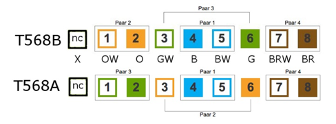
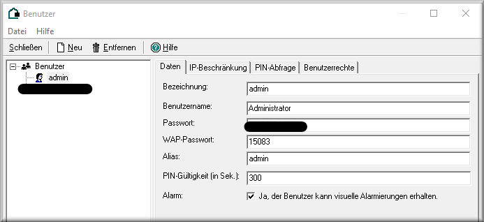
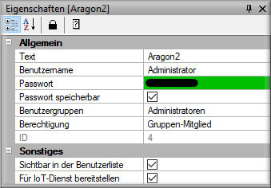
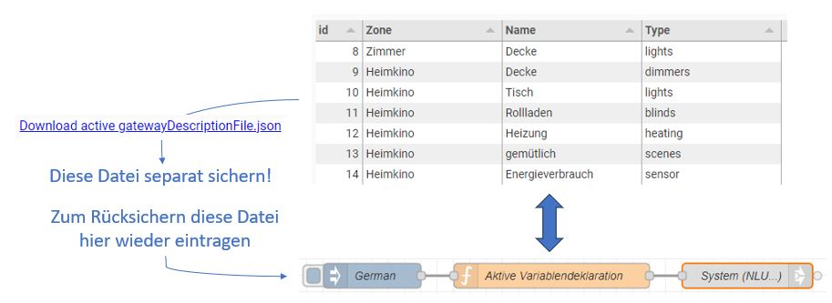
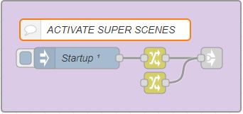

# ARAGON 2

***
# CONTENT

[General](#allgemeines)

[Features](#eigenschaften)

[Setup](#aufstellung)

[Mechanical and Electrical Installation](#mechanische)

[Step by Step Commissioning](#inbetriebnahme)

> [Aragon Master Configuration Interface](#verbindung)

> [Language Setting](#sprache)

> [Gateway Setting](#gateway)

> [Update](#update)

> [Gateway Configuration](#konfiggate)

> [Satellite Configuration](#konfigsat)

[Configuration for SONOS](#sonos)

[Appendix 1: Server and Gateways](#Anhang1)

> [proServ by ProKNX](#proServ)

> [X1 by Gira](#x1)

> [Homeserver by Gira](#homeserver)

> [all-KNX](#allknx)

> [SVS by Jung](#svs)

[Appendix 2: What is Understood](#Anhang2)

> [Light Control](#lights)

> [Shutter Control](#shutter)

> [Scenes](#scenes)

[Appendix 3: Helpful Settings](#Anhang3)

> [Disable Global Commands](#globalcmd)

> [Set Functions to the Blacklist](#blacklist)

> [Use of AV Control](#av-control)

***

<h1 id="allgemeines">General</h1>

## Description

**Aragon** is the first AI-supported voice control system that works without an internet connection. The speech recognition runs on the device - nothing is transmitted or recorded.

**Your privacy is guaranteed**

An Aragon installation consists of one (and only one) **Master** and **1 - 10 Satellites**. The Master is mandatory and responsible for most tasks, e.g. for understanding voice commands and interacting with the home automation system. The Master works with one or more satellites. The satellites are available in two versions:
- Satellite2 WL 
in a table housing with RJ45 connection or Wi-Fi and power supply via 5V USB power adapter
- Satellite2 PoE
in a switch box format with PoE connection. It is supplied with a 55x55mm speaker front but without a frame. Three colors are available, white, black or aluminum. LS front for LS990 and LS-Zero also possible, please inquire separately.

Every combination of WL and PoE Satellite is possible. All Aragon devices must be installed in the same network.
***

<h1 id="eigenschaften">Features</h1>

## Privacy

- The offline voice control system works even without an internet connection. What is said at home, stays at home
- The spoken word is neither transmitted nor recorded
- Voice recognition and evaluation runs on the device
- No internet account, no "skill" needs to be activated

## Flexibility

- Fully customizable. Personal words and phrases can be easily learned and understood by the assistant
- Commands can be formulated in thousands of variations
- ProKNX can take into account special customer needs in the language vocabulary
- The system is interoperable and can work with other systems

***

<h1 id="aufstellung">Setup</h1>

The following points should be considered for the installation location of the ARAGON satellites:
- There should be no speaker in the immediate vicinity (not closer than 2m)
- When using several Aragon satellites, the distance between them should be as large as possible to avoid triggering two devices at the same time.
- The use of several devices in one room is possible, but should be coordinated with us (ProKNX) beforehand.
- The distance to the speaker can be more than 7m in a quiet environment. Thus, rooms with a length of 15m are covered by one device, provided it is centrally located.
- Ambient noise affects understanding. Particularly disturbing are simultaneous speakers.
- It is possible to mute media devices after recognizing the wake word. We offer a function for this in the NodeRed Flow. Sonos speakers are automatically muted if the installation room is identical to the SONOS zone.

***

<h1 id="mechanische">Mechanical and electrical installation</h1>

## Aragon Master 

(Art. No. 139)

The ARAGON Master is intended for installation in a network cabinet. It must be supplied with 5VDC, the power supply (included in the delivery) delivers a maximum current of 3A and is connected to the USB-C port of the Master. In addition, a network connection must be established with the RJ45 output, which is labeled "LAN".

## Aragon Satellite2 WL 

(Art. No. 185)

Aragon Satellite2 WL can be set up as a tabletop device. Alternatively, it can also be screwed to the wall or ceiling using the adapter plate. 
Detach the adapter plate from the device by turning it clockwise. 
When setting up as a tabletop device, the four supplied rubber feet can now be inserted into the recesses of the screws.
When choosing the location, make sure that there are no speakers in the immediate vicinity (no closer than 2 m). When using several ARAGON devices, the distance between them should be chosen as large as possible so that not two devices understand the activation word at the same time.

## Aragon Satellite2 PoE 

(Art. No. 184)

When choosing the installation location, it should be noted that there should ideally be no speaker in the immediate vicinity (no closer than 2m). When using several Aragon satellites, the distance between them should be chosen as large as possible to avoid addressing two devices at the same time. A very suitable installation location is often the middle of the room ceiling, as the distance to the speaker is usually small. Directly next to the room door (e.g. next to the light switch) is often not recommended, as the ARAGON of the neighboring room could also be activated with the wake word when the door is open.
The device is connected to a CAT5, CAT6 or CAT7 using screw terminals. The color code of the designations corresponds as follows:

> 

Terminal X is not used. 
The Aragon is operated via the simple PoE standard, i.e. IEEE 802.3af with 48VDC / approx. 13W usable power. The power consumption is approx. 10W.

***

<h1 id="inbetriebnahme">Commissioning step by step</h1>

<h2 id="verbindung">Configuration interface Aragon Master</h2>

Starting the Aragon Master takes about 2 minutes. It is sufficient to apply the operating voltage. After that, you can find it in the network using a browser (Firefox, Chrome...) by entering the address <http://find.heyaragon.com>. In the input field of the window that opens, the subnet of the network must be specified, e.g. "192.168.1."
After a short time, the link (the IP address) of the Aragon Master is displayed, which can simply be clicked. A special port specification is not necessary, as the Master is reached via port 80.
The window of the Master configuration interface allows commissioning step by step. However, initial settings must first be made, which in particular concern the user language and the gateway used for process coupling. It is also recommended to carry out system updates at this time. 
These default settings can be accessed directly via various menu items on this page:

<h2 id="sprache">Language Setting</h2>

Please first make sure that the device language is set correctly (menu item "LANGUAGE")
 
> **Attention:** The language set here not only changes the language of the displayed user interface but also affects an update and the updating of the system software. 
Please also make sure that any automatic translation of the browser window in the browser you are using is deactivated.

<h2 id="gateway">Gateway Setting</h2>

Aragon expects the definition of a default gateway, through which it works with the building automation. The currently set gateway can be seen on the first picture of the configuration page, for example:

If this gateway does not match the device used in your installation, please set the correct gateway for your Aragon. To do this, go to the menu item "ABOUT"
Here you will find the line:

The window that then opens allows the installation of one of the gateways or servers we support. A list of the servers, their description and the respective supported functions are described in [Appendix 1: Servers and Gateways](#Anhang1).

<h2 id="update">Update</h2>

The menu item "ABOUT" also allows an update of various packages of the Aragon Master to be carried out.
Unless otherwise agreed, we recommend carrying out the following three update processes:

**1. Update Aragon System Software**
The first of the three updates mentioned here updates the system software of Aragon Master. This affects the following versions mentioned here:

**2. Update / Installation Language Application**
This button installs or updates the NodeRed Flow "ARAGON V2.0" which is essential for the operation of Aragon. In addition to communicating with the corresponding gateway (data acquisition, addressing of the data points...) it also analyses the recognised command and much more.

> **Attention:** If you have made changes in this flow, they will be deleted, and the default will be restored. If you want to keep your changes, they must be manually saved beforehand.

Version control is directly visible in one of the groupings of this main flow:

**3. Update / Installation Language Assistant**

The third entry installs the language assistant. This determines how the understood words should be interpreted.
> **Attention:** The assistant is installed depending on the language set for the user interface.

If changes in understanding certain sentence positions are desired, these can be communicated to us. After adjustment on our side, this will be activated by installing the modified assistant.

<h2 id="konfiggate">Configuration of the Gateway</h2>

- The **"Gateway Configuration"** dialog varies depending on the gateway set. Details on this are listed separately for each gateway in [Appendix 1: Server and Gateways](#Anhang1).
The first two checkboxes must turn green. This indicates that the connection between Aragon Master and Gateway is correctly initialized, and communication exists.

- The **"Voice"** button offers various voices through a dialog, whose speech output is generated offline via an internal TTS.
    > **Attention:** Generating the speech file is very computationally intensive. As a rule of thumb, one can assume that the computing time makes up a third of the duration of the spoken text.

- **Training new words** is necessary after each change in the configuration of the data read in via the gateway. The "ASR" (Automatic Speech Recognition) must be informed which words are listed in the dictionary, which will finally be understood after a completed training run.

<h2 id="konfigsat">Satellite Configuration</h2>

After pressing the **"Satellite Search"** button, the IP addresses of the found satellites will be displayed in the pull-down menu below within a short time.
Now select one of the addresses and press the **"...more about this"** button.

- When the **"Output Test Signal"** button is pressed, the satellite with the displayed IP address will emit a tone.
- Now in the **"Room"** line, select the corresponding room where this Aragon is installed.
- The **"Sensitivity"** setting allows you to adjust the activation sensitivity of the activation word. A lower sensitivity means that Aragon will not be awakened as easily, and the activation word must be spoken very precisely.
- The improved **"Wake word System"** allows for a greater selection of activation words
- For the selected **"Wake word"**, the specified language should correspond to the selected language, as activation words are only recognized when they are pronounced correctly in the corresponding language. The satellites can certainly be configured with different activation words.
- The **"Wi-Fi"** button is only active on an Aragon WL. In the dialog that opens, the corresponding access point can be selected from the list of Wi-Fi SSIDs. After entering the Wi-Fi password, the connection is established and the network cable can be unplugged.
    > **Attention:** Only 2.4 Ghz Wi-Fi is supported

    > The SSID name must not contain any special characters or spaces

    > After logging into the Wi-Fi network, the satellite receives a new IP address

- **"Open the App"** opens a new browser window with the IP address of the satellite
- **"Restart the App"** restarts the application on the satellite
- **"Restart"** performs a restart of the satellite.
- **"Shut down"** shuts down the satellite and turns it off. A restart is only possible through a power-cycle.
- **"Update"** performs an update of the satellite
- **"Receive Wake words"** downloads the current collection of wake words to the device.
- The **"Audio Test"** allows for a test of the microphone in particular.
- The **"DeepFilterNet Noise Reduction"** is a powerful digital filter that can effectively block out ambient noise. "Foreign voices" can only be poorly eliminated, as they cannot be well distinguished from the user data. The filter should not be activated in case of low ambient noise.

***

<h1 id="sonos">Configuration for SONOS</h1>

The integration of a SONOS music system is done by **setting the name of the SONOS zone identical to the name of the room of a satellite**.

Subsequently, the following functionalities are enabled:

> **When the activation word is detected, the SONOS zone is muted**
This has the advantage that the spoken command is understood much better by ARAGON afterwards, as the ambient noise is reduced

> **Playlists, music titles and radio stations can be started by name**
However, this function requires that the corresponding music pieces or lists or stations be saved as SONOS favorites. Directly in the SONOS app, it is possible to give these favorites their own name (preferably in German), so that they are easier understood by ARAGON. After setting the favorites, a training run of the words must be carried out.

> **The voice output of the ARAGON satellites can be redirected to the respective SONOS zone** 
on request

Functions:

- **Start music**
*play music in the living room*, *turn on the radio in the kitchen*, *turn on "my music"* (with the favorite title as "my music"), *play anything*

- **Stop music**
*turn off the music*, *turn off the radio*, *stop the music in the kitchen*

- **Set volume**
*turn up the music*, *turn down the volume*, *make it a bit quieter*, *turn down the radio in the kitchen*, *set the volume in the living room to 30%*

- **Title jump**
The title jump only works with a running playlist
*next title*, *play next song*, *play the following title*, *play the last title*, *repeat the last piece*

- **Shazam**
*what's the name of the song*, *what's the name of the singer*

***
***

<h1 id="Anhang1">Appendix 1: Servers and Gateways</h1>

| Gateway | Description |
| ------ | ------ |
|[proServ by ProKNX](#proServ)|A gateway that allows the entire configuration of voice control via the ETS. Operation of the KNX installation via app and voice can thus be carried out solely via an ETS configuration|
|[X1 by Gira](#x1)|The configuration of a Gira X1 accessible on the network is read out and can be operated with voice|
|[Homeserver by Gira](#homeserver)|The configuration of a Gira Homeserver (from Vers. 4.10) with configured Quadclient accessible on the network is read out and can be operated with voice|
|Philips HUE|The building and function structure of a HUE Bridge is read out and can be operated by voice|
|KNX IoT|Any device that supports the KNX 3rd Party IoT protocol can be read out and operated|
|[all-KNX](#allknx)|If there is no one of the listed KNX servers in your installation, the communication between Aragon and the KNX bus can also be carried out with a standard KNXNet/IP interface|
|Generic Gateway|Allows even the communication between Aragon and other devices according to a rule (RestfulAPI, http commands, …) to be determined|
|YOUVI by PEAKnx|Supports the operation of the YOUVI visualization by voice|
|[SVS by Jung](#svs)|Supports the operation of the Smart Visu Server from Jung by voice|
|LUXORliving by Theben|Supports the operation and the query of a LUXORliving installation from Theben by voice (KNX installation completely without ETS)|
|Option ENOCEAN|This option allows in addition to one of the above defined standard gateways also the use of sensors and actuators that support the Enocean standard|

***

<h2 id="proServ">proServ by ProKNX</h2>

We assume that before the voice control is put into operation, the proServ for visualization has already been configured and tested. It should be noted that not all functions offered by proServ can also be used for voice control and query. Here is a list of possible functions:

- **Switching**
The function is interpreted for switching for light (e.g. *"turn the light in the living room on/off"*). 

    > **Note:** - The name of the light is recognized exclusively for the entire installation, i.e. you do not have to say the room name if the device only exists once in the installation.

    > **Attention:** Do not use this function if aggregates or switchable sockets are to be operated, as they would then also be switched on/off with the command "Switch the light on/off". Use the "AUX" function for this!

- **Dimming**
The function is used for dimming the light. The voice command allows *switching*, *relative dimming* (e.g. *"make it brighter"*), *absolute dimming to a certain value* (e.g. *"set the light to 50%"*), and *querying the state* (e.g. *"how is the light?"*). 

    > **Note:** - The name of the light is recognized exclusively for the entire installation, i.e. you do not have to say the room name if the device only exists once in the installation.

- **Blinds with byte feedback**
This is the only function that allows voice control and query of a blind. The function assumes that the actuator for positioning and feedback of the position has been configured! The communication objects for start and stop are not used for the language.

- **AUX - Switching - toggling**
The command allows the identical voice commands as the "Switching" command. The big difference, however, is that this function is not interpreted with the generic term "light". Example: *"Turn off the children's room"* will turn off all "Switching" and "Dimming" functions, but not an AUX function!

- **Status - 2 Bytes Floating Point Value**
This function allows querying the value by language. The specified unit is also announced. A possible query could be: *"What is the status of the humidity?"*, or *"what is the temperature?"*

- **Status - 4 Bytes Unsigned**
This function allows querying the value by language. The specified unit is also announced. A possible query could be: *"What is the status of the water meter?"*

- **Status - 4 Bytes Signed**
This function allows querying the value by language. The specified unit is also announced. A possible query could be: *"What is the energy consumption?"*

- **Status - 4 Bytes Floating Point Value**
This function allows querying the value by language. The specified unit is also announced. A possible query could be: *"What is the status of the current?"*

- **RTR with 1Bit Operating Mode**
This is the only function that allows control and query of a room temperature controller by language. Regardless of the set name of the function, it can be queried *"what is the thermostat"* or *"what is the temperature"*. The response will announce both the actual and the current set temperature. The set temperature can also be adjusted, both absolutely and relatively (e.g. *"increase the temperature a bit"* or *"set the thermostat to 21 degrees"*)

- **Scenes**
...are very powerful functions. They allow assigning a scene number to a scene name. When the scene name is spoken, the corresponding number (KNX compliant "-1") is written to the bus. No spoken "addition" is required, it is sufficient to pronounce the name as set (e.g. *"Call the elevator"*, *"activate yellow"* or *"good night"*)

> **Attention:** After changing the configuration of the proServ via the ETS, the new data must be read out by the ARAGON Master, and the words subsequently "trained". This process is triggered by a restart of NodeRed **(to be selected in the NODE-RED menu: Reset Node-Red -> Restart)**. This takes about 90 seconds.

***

<h2 id="x1">X1 by Gira</h2>

**Preparations on X1:**
- In the **Gira Project Assistant** (GPA), a "fixed user" named "Administrator" with the role "Administrator" must be created in the user administration.

- Since **special characters** are not spoken, they must be removed in the GPA. This includes brackets, periods, dashes, and slashes. Umlauts are possible.
- Avoid **abbreviations** as they are not pronounced by voice (e.g. instead of "HWR" -> "utility room")
- Avoid **enumerations** (instead of "Children's room 1", "Children's room 2"... better use "Max", "Moritz"). Write out numbers (Bathroom 1, Bathroom 2 -> "Bathroom one", "Bathroom two")

Connect the ARAGON Master to the network only after a configured GIRA X1. 
After about 2 minutes of startup, the ARAGON Master can be searched for in the network using a browser: http://find.heyaragon.com. 

The configuration interface is accessed via the found IP address.

The "Gateway Configuration" button opens a dialog that allows the input of the X1's IP address. On initial startup, the Aragon Master finds this address independently.
In the same window, the administrator password set in the GPA must be entered.

After closing this dialog, the Aragon Master tries to establish a connection to the Gira X1. The "Connection status" checkmark should now turn green.

**The following functions** of the X1 are supported for voice control and query:

The function is interpreted for switching light (e.g. *"turn on/off the light in the living room"*).

> **Note:** - The name of the light is recognized exclusively for the entire installation, i.e. you do not have to say the room name if the device only exists once in the installation.

> **Attention:** Do not use this function if aggregates or switchable sockets are to be operated, as they would then also be switched on/off with the command "Turn on/off the light". Use the function **"Button"** for this!

The function is used for dimming the light. The voice command allows *switching*, *relative dimming* (e.g. *"make it brighter"*), *absolute dimming to a certain value* (e.g. *"set the light to 50%"*), and *querying the state* (e.g. *"how is the light?"*).

> **Note:** - The name of the light is recognized exclusively for the entire installation, i.e. you do not have to say the room name, provided the device only exists once in the installation.

The command allows the identical voice commands as the "Switch" command. The big difference, however, is that this function is not interpreted with the generic term "light". Example: *"Switch off the children's room"* will switch off all "Switch" and "Dim" functions, but not a "Button" function!

![shutter-x1-de.jpg]./_images/shutter-x1-de.jpg)

This function allows the control and query of a blind by voice. The function requires that the actuator has been configured for positioning and feedback of the position and the corresponding group addresses have been declared in the GPA! The addresses for start and stop are not used for the language.

This function allows the control and query of a room temperature controller by voice. Regardless of the set name of the function, it can be queried *"what is the thermostat"* or *"what is the temperature"*. The response will announce both the actual and the current set temperature. The set temperature can also be set, both absolutely and relatively (e.g. *"increase the temperature a little"* or *"set the thermostat to 21 degrees"*)

Scenes are very powerful functions. They allow the assignment of a scene number to a scene name. When the scene name is spoken, the corresponding number (KNX compliant "-1") is written to the bus. No spoken "addition" is required, it is sufficient to pronounce the name as set (e.g. *"Call the elevator"*, *"activate yellow"* or *"good night"*)

This function allows the value to be queried by language. The specified unit is also announced. A possible query would be: *"What is the status of the humidity?"*, or *"what is the temperature?"*. Both 2Byte float and 4Byte float values are supported.

This function allows the value to be queried by language. The specified unit is also announced. A possible query would be: *"What is the energy consumption?"*

This function allows the value to be queried by language. The specified unit is also announced. A possible query would be: *"What is the status of the water meter?"*

With this function, a preset value stored in the GPA can be sent to a group address. e.g. *"Activate the default value"*

> **Attention:** After changing the configuration of the X1, the new data must be read out by the ARAGON Master, and the words must then be "trained". This process is triggered by a restart of NodeRed **(to be selected in the NODE-RED menu: Reset Node-Red -> Restart)**. This takes about 90 seconds.

> **Error messages**
If an error message appears due to special characters used, please delete these in the GPA configuration. The "Train new words" button in the "Gateway Configuration" area allows a list of all read-in words. Here, the special characters can be quickly located.

***

<h2 id="homeserver">Homeserver by Gira</h2>

**Preparations at the Homeserver:**
- In the **Gira Expert**, a user named "Administrator" must be created in the user administration.

In the **QuadClient**, a user for Aragon must be created. **The option "Provide for IoT service" must be selected**

- Since **special characters** are not spoken, they must be removed in the QC. This includes brackets, periods, dashes, and slashes. Umlauts are possible.
- Avoid **abbreviations** as they are not pronounced in speech (e.g. instead of "HWR" -> "utility room")
- Avoid **enumerations** (instead of "Children's room 1", Children's room 2"... better use "Max", "Moritz"). Write out numbers (Bathroom 1, Bathroom 2 -> "Bathroom one", "Bathroom two")

Connect ARAGON Master to a configured GIRA Homeserver in the network only after it has been set up. 
After about 2 minutes of startup, ARAGON Master can be searched for in the network using a browser: http://find.heyaragon.com. 

The configuration interface is accessed via the found IP address.

The "Gateway Configuration" button opens a dialog that allows the input of the Homeserver's IP address. 
The administrator password set in the expert is to be entered in the same window.

After closing this dialog, Aragon Master tries to establish a connection to the Gira Homeserver. The "Connection status" checkmark should now turn green.

**The following function templates** of the QC are supported for control and query by voice:

**Switch plus**

Function is interpreted for switching light (e.g. *"turn on/off the light in the living room"*).

> **Note:** - The name of the light is recognized exclusively for the entire installation, i.e. you do not have to say the room name if the device only exists once in the installation.

> **Attention:** Do not use this function if aggregates or switchable sockets are to be operated, as they would then also be switched on/off with the command "Switch the light on/off". Use the function template **"Pushbutton plus"** for this!

**Dimmer plus**

Function is used for dimming the light. The voice command allows *switching*, *relative dimming* (e.g. *"make it brighter"*), *absolute dimming to a certain value* (e.g. *"set the light to 50%"*), and *querying the state* (e.g. *"how is the light?"*).

> **Note:** - The name of the light is recognized exclusively for the entire installation, i.e. you do not have to say the room name, provided the device only exists once in the installation.

**Button plus**

The command allows the identical voice commands as the "Switch plus" command. The big difference, however, is that this function template is not interpreted with the generic term "light". Example: *"Switch off the children's room"* will switch off all "Switch plus" and "Dimming plus" functions, but not a "Button plus" function!

**Roller shutter awning roof window**

This function template allows the control and query of a roller shutter by voice. The function assumes that the actuator for positioning and the feedback of the position has been configured and the corresponding group addresses have been declared! The addresses for start and stop are not used for the language.

**Heating plus**

This function allows the control and query of a room temperature controller by voice. Regardless of the specified name of the function, it can be queried *"what is the thermostat"* or *"what is the temperature"*. The answer will announce both the actual and the current set temperature. The set temperature can also be adjusted, both absolutely and relatively (e.g. *"increase the temperature a little"* or *"set the thermostat to 21 degrees"*)

**Scene plus / Trigger**

Scenes are very powerful functions. They allow the assignment of a scene number to a scene name. When the scene name is spoken, the corresponding number (KNX compliant "-1") is written to the bus. No spoken "addition" is required, it is sufficient to pronounce the name as specified (e.g. *"Call the elevator"*, *"activate yellow"* or *"good night"*)

**Sensor with limit value**

This function allows the value to be queried by voice. The specified unit is also announced. A possible query would be: *"What is the status of the humidity?"*, or *"what is the temperature?"*, *"What is the energy consumption?"*, *"What is the status of the water meter?"*

> **Attention:** After changing the configuration of the QC, the new data must be read out by the ARAGON Master, and the words subsequently "trained". This process is triggered by a restart of NodeRed **(to be selected in the NODE-RED menu: Reset Node-Red -> Restart)**. This takes about 90 seconds.

> **Error messages**
If an error message appears due to the use of special characters, please delete these in the GPA configuration. The "Train new words" button in the "Gateway Configuration" area allows a list of all read words. Here, the special characters can be quickly located.

***

<h2 id="allknx">all-KNX</h2>

ARAGON Master can be configured so that commands and queries are made via a KNX Net/IP interface via group addresses.

The configuration is stored in a file in JSON format. This file can be created manually and is relatively easy to read as a text file. We call this file GDF (Gateway Description File).

**Creating or restoring the GDF file via Node-Red:**
The GDF file can be created in the respective language (English, German and French) via NodeRed or the saved file can be restored. To do this, open Node-Red with **"open flow editor"** and the user **"user"** as well as the password printed on the device.

By selecting the node **"German"**, the JSON file can be displayed in a readable way and also edited.

Changes made are saved by the **"Adoption (deploy)"** button at the top right.
Only after activating the manual injection (small blue area on the left in the node) is the file active and overwrites the last configuration.

The defined names must now be trained. This is done via the menu item **"Master" -> "Train new words"**.

> **As an alternative to the method described above for creating the configuration, which requires knowledge of JSON syntax, we recommend using the GDF Editor.**

**The GDF Editor**

The GDF Editor can be accessed via the Node-Red Dashboard. The link can be found under the tab **"NodeRed" -> "Open Dashboard"**.

After changes have been made, they must be adopted using the **"SAVE AND APPLY"** button at the bottom of this page.

The names defined in this way must still be trained by ARAGON. This is done via the menu item **"Master" -> "Train new words"**.

> **IMPORTANT:** Please permanently save these settings as part of the project documentation. Although they are stored "non-volatile" in the device, they will be overwritten if the "Language Application (Action & Logic)" under the "About" tab is reinstalled. The file can be saved via the link **"Download active gatewayDescriptionFile.json"** which is located below the **"SAVE AND APPLY"** button.

The GDF Editor displays the image of the active variable declaration. The saved GDF file can be copied into the "German" node, thus enabling a backup.

**Data point types for voice control**

The GDF Editor offers the following data point types:

- **lights**
These are switched devices that respond to the name light. They are operated binary via ON/OFF and also have a binary feedback (DPT 1.001)
- **dimmers**
These are devices that respond to the name light. They can be switched binary (DPT 1.001) or set via a value (DPT 5.001). The feedback is sufficient via the value (DPT 5.001).
- **blinds**
These are devices that respond to the name roller shutter. They can only be set via a value (DPT 5.001). A value (DPT 5.001) is also required for feedback.
- **heating**
These are devices that respond to the name thermostat. Three data points are required: 
Current Temperature: Current room temperature, (DPT 9.001)
Target Temperature: Desired temperature (DPT 9.001)
Actual Target Temperature: Current desired temperature (DPT 9.001)
- **scenes**
Scenes are defined by a name, which sends a value (scene number) from 1…64 (DPT 17.001) to a group address when activated.
- **sensor**
Sensors can only be queried. In addition to the group address, the DPT type and the unit are also stored. The ETS is best used to determine the DPT type, as the type is displayed there for the group address used.
- **aux**
…. Are devices or functions that should not respond to the name light and can still be switched. Here, binary data points can be created as DPT 1.001, which are operated via switching instructions (On/Off). However, it is also possible to exclude a switch-over of the data point by always only sending a fixed value (On or Off) with the command. The voice command is then similar to a scene that is "activated".

***

<h2 id="svs">SVS by Jung</h2>

Please carry out the commissioning of the SVS according to the manufacturer's instructions.

**Update of JUNG SVS**

If your Jung SVS has a firmware version number of 1.2.1650 or older, you need to update it.

1.	Back up the configuration of your SVS in the JUNG configuration interface (Settings -> System -> Backup)
2.	Go to the settings and select the "Start" button in the "Update" area
3.	-> The update takes 5 - 10 minutes
4.	-> The system will automatically restart
5.	Go to user management
6.	Create at least one administrator
7.	**Activate the https protocol** (without https, no communication can be established with the SVS!)

Connect ARAGON Master to a network only after an SVS has been configured. 
After about 2 minutes of startup, ARAGON Master can be searched for in the network using a browser: http://find.heyaragon.com.

The configuration interface is accessed via the found IP address.

The **"Gateway Configuration"** button opens a dialog that allows the entry of the IP address of the SVS. The address is automatically entered during initial commissioning if an SVS is found in the network.

For the **password**, please enter the "Administrator Password". This is set via the JUNG project planning software in the "User Management" area.

The following **functions** of the SVS are currently supported for offline voice commands:

- Switch/Dimmer
- Switch
- On/off (is not processed as "light", so is not considered in global commands such as "turn off the light in the room")
- Dimmer
- Dimmer/switch
- Motor
- Roller/Shutter/Awning
- Venetian Blind (Slider + Button)
- Heating
- Base Setpoint
- Scene
- Activate scene
- Value/State
- Display 2Byte float
- Display 2Byte lux
- Display 4Byte float
- Display 4Byte unsigned integer
- Display 4Byte signed integer
- Value transmitter
- Send 1Byte (0-100%)

> Make sure that voice control has been activated in the respective function of the SVS

**Error messages**

If an error message appears due to the use of special characters, please delete these in the configuration. Do not use abbreviations in the names. Write out numbers ("Kinderzimmer 2" -> "Kinderzimmer two").

***
***

<h1 id="Anhang2">Appendix 2: What is understood</h1>

Language allows different ways to express a command. The so-called NLU (Natural Language Understanding) allows these different sentence positions and expressions to be interpreted by the computer.

As an example: The following expressions all have the same goal, yet they are fundamentally different:

- *Turn on the pendant lamp*
- *Switch on the pendant lamp*
- *Turn on the pendant lamp*
- *Turn up the pendant lamp*

If the device is to be operated in a certain room, the variety increases by at least a factor of 4, as the room name can be mentioned before or after the device. Furthermore, when using dimming actuators, the light can be adjusted absolutely and relatively.

All these combinations should be clearly understood!

For this purpose, the commands are assigned to so-called INTENTs. The following intents are implemented:

<h2 id="lights">Light control</h2>

Operating individual lighting circuits:
- *Switch on/off the {FUNCTION} in {ZONE}* -> The lighting circuit with the name {FUNCTION} in the room with the name {ZONE} is operated
- *Set the {FUNCTION} in {ZONE} to 50%* -> The lighting circuit with the name {FUNCTION} in the room with the name {ZONE} is set to 50%
- *Make the {FUNCTION} brighter* -> The lighting circuit with the name {FUNCTION} in the zone assigned to the satellite is set 20% brighter

Operating multiple lighting circuits:
- *Turn on/off the light* -> All lighting circuits in the configured zone of the satellite are operated
- *Turn on/off the light in {ZONE}* -> All lighting circuits in the mentioned zone are operated
- *Turn on/off the light everywhere (or "in the whole house", "in the apartment")* -> The lighting circuits in the entire installation are operated
- *Make the light brighter* -> All lighting circuits in the configured zone of the satellite are set 20% brighter
- *Set the light to 50%* -> All lighting circuits in the configured zone of the satellite are set to 50%
- *Turn off the {Zone}* -> All lighting circuits of the corresponding room are turned off

> **Unique Name Recognition:** For lights (and only here), name recognition is extended to the entire installation. So if the name is unique, the name of the room does not need to be mentioned. However, if there are several lighting circuits with the same name in the installation, all these lighting circuits will be served.

> **Wildcard**: The names "light", "lighting", "lamps" are placeholders for all light functions (switched and dimmed) in the room or in the house. "Light on" therefore searches for all lighting circuits in the room and switches them on. Therefore, it is not useful to name a lighting circuit with one of the wildcard names, as it cannot be addressed individually.

> **Global commands** can be deactivated (see here: [Deactivate global commands](#globalcmd))

***

<h2 id="shutter">Blinds Operation</h2>

Operating individual blinds:

- *Open/Close the roller shutter* -> The hanging with the name "roller shutter" in the zone assigned to the satellite is moved to the respective end position
- *Extend the awning in the outdoor area* -> The hanging with the name "awning" in the "outdoor area" zone is extended
- *Open/Close the blind a little* -> The hanging with the name "blind" in the zone assigned to the satellite is opened/closed by 20%
- *Position/move the {FUNCTION} in {ZONE} to 20%* -> The addressed hanging in the specified room is set to 20%. (100% means completely closed)

Operating several blinds:

- *Open/Close the roller shutters* -> All functions defined as hanging in the zone assigned to the satellite are moved to the respective end position
- *Open/Close the blinds in the whole house* -> All functions defined as hanging in the entire installation are moved to the respective end position
- *Close the {zone}* -> All functions defined as hanging in the corresponding room are closed

> **Wildcard**: The names "roller shutters", "blinds", "rollos" (only in the plural) are placeholders for all motor drives in the room or in the house. "Raise all roller shutters" therefore searches for all hanging functions in the room and moves them to the upper end position. If there are both roller shutters and motor-driven mosquito protection in a room, both systems would be opened with this command.

> **Doors, gates, motorized screens**: These devices are not addressed with the wildcard names.

> **Global commands** can be deactivated (see here: [Deactivate Global Commands](#globalcmd))

***

<h2 id="scenes">Scenes</h2>

Scenes are universally applicable commands. There are two types to distinguish:
> **KNX Scenes**
The affected members (actuator channels) of a KNX scene (also called extension scene) must already be configured in the ETS.
During runtime, however, it can be set how each actuator channel should behave when a scene number is called. 
For most actuators, the actuator parameters can also be used to determine whether an actuator channel is affected by the scene number at all, even if it is assigned to the group address of the scene.

> [**Super Scenes**](#vocalautomating)
Aragon offers four super scenes (here is a list with some command alternatives):

|Good Morning|Good Night|I'm Home|I'm Leaving the House|
|-----|-----|-----|-----|
|Morning|Sleep well|I'm back|Goodbye|
|Moin|See you tomorrow|We're back|Bye bye|

**Super Scenes** can be very easily (also by the end user) edited. It is sufficient to write the command understood by Aragon **in plain text into one of the command lines**. It is also possible to have Aragon **speak a text** after calling the super scene. For this, the text `SAY` must be prefixed to the text to be read out

> **Attention**: If the use of super scenes is activated, these commands take precedence over identically named KNX scenes.

**Deactivation of Super Scenes:**

Many KNX applications already use the names of the super scenes. If the super scenes are then to be deactivated, please make the following modification in the Main Flow under NodeRed:

**Commands for Scenes**
Except for the global super scenes, the scene command always refers to the room to which the satellite has been configured.
In addition, scenes have the property that pronouncing the scene name alone triggers the execution of the command. This allows you to generate very specific commands:

*Call the elevator* in front of the satellite on floor 1 would, for example, trigger scene number 1

*Call the elevator* in front of the satellite on floor 2 would, for example, trigger scene number 2

***
***

<h1 id="Anhang3">Appendix 3: Helpful Settings</h1>

<h2 id="globalcmd">Disable Global Commands</h2>

In large installations (e.g., when using an Aragon Master for several residential units), it may be necessary to disable global commands.

To do this, copy the following group into a new flow (tab) and then set the value of the manual Inject node to "false". 

Now execute the deploy!

***

<h2 id="blacklist">Put Functions on the Blacklist</h2>

Especially in very large installations, hundreds of functions are often read from the KNX server. Many of them are not intended for voice control or must not be operated with voice.
To exclude these for Aragon, a blacklist can be created, which lists the names of the functions not to be operated.

In the Aragon V2.0 Mainflow, the following group is offered for this purpose:

Copy this group into a new flow and edit the function block with the JSON file.

***

<h2 id="av-control">Use of AV Control</h2>

The following functions enable both TV and audio to be controlled in a zone where ARAGON is also set up. 

In the Main-Flow of NodeRed, a group **"CUSTOM MEDIA CONTROL"** is available for this purpose, which can best be copied into a new flow.

The following commands are available for media device control:

- Increase volume (relative)
- Decrease volume (relative)
- Set the volume (absolute, 0 – 100%)
- AV system start (Turn on/Play)
- AV system stop (Turn off/Pause)
- Next title/channel
- Previous title/channel selection
- Query what is being played (SONOS only)
- Channel title selection by name

Now open the filter node and comment on line 4 to activate it.
