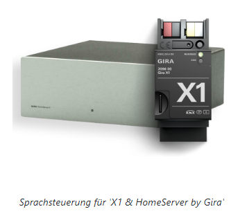
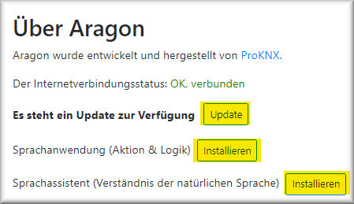
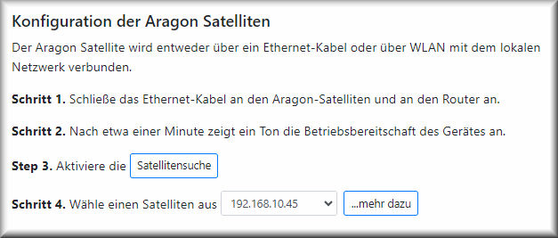
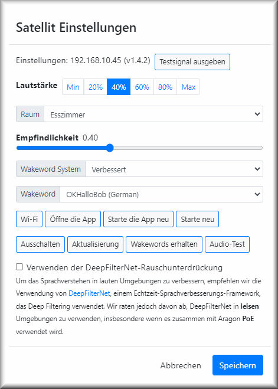
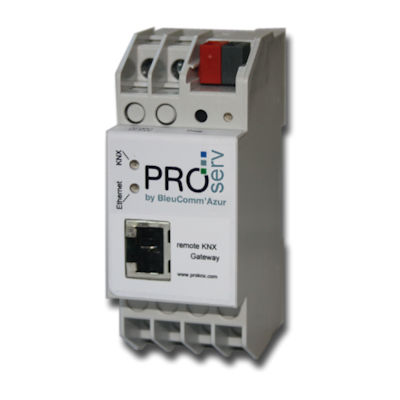
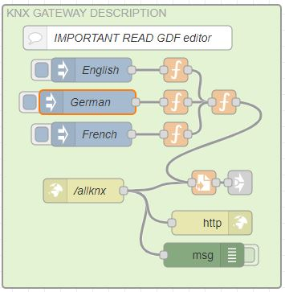
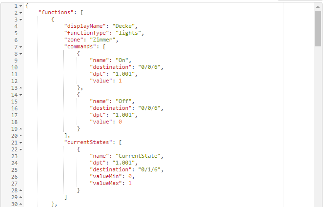
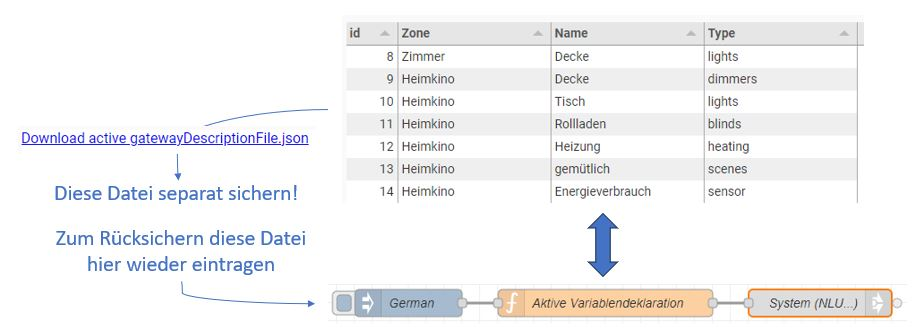

# ARAGON 2

***
# INHALT

[Allgemeines](#allgemeines)

[Eigenschaften](#eigenschaften)

[Aufstellung](#aufstellung)

[Mechanische und elektrische Installation](#mechanische)

[Inbetriebnahme Schritt für Schritt](#inbetriebnahme)

> [Konfigurationsoberfläche Aragon Master](#verbindung)

> [Einstellung der Sprache](#sprache)

> [Einstellung des Gateways](#gateway)

> [Update](#update)

> [Kofiguration des Gateways](#konfiggate)

> [Kofiguration der Satelliten](#konfigsat)

[Konfiguration für SONOS](#sonos)

[Anhang 1: Server und Gateways](#Anhang1)

> [proServ by ProKNX](#proServ)

> [X1 by Gira](#x1)

> [Homeserver by Gira](#homeserver)

> [all-KNX](#allknx)

> [SVS by Jung](#svs)

[Anhang 2: Was verstanden wird](#Anhang2)

> [Lichtbedienung](#lights)

> [Jalousiebedienung](#shutter)

> [Szenen](#scenes)

[Anhang 3: Hilfreiche Einstellungen](#Anhang3)

> [Globale Befehle deaktivieren](#globalcmd)

> [Funktionen auf die Blacklist setzen](#blacklist)

> [Verwendung von AV Control](#av-control)

***

<h1 id="allgemeines">Allgemeines</h1>

## Beschreibung

**Aragon** est le premier système de commande vocale basé sur l'IA qui fonctionne sans connexion Internet. La reconnaissance vocale se fait sur l'appareil - rien n'est transmis ou enregistré.

**Votre vie privée est garantie**

Une installation Aragon se compose d'un (et un seul) **Master** ainsi que de **1 à 10 satellites**. Le Master est obligatoire et est responsable de la plupart des tâches, telles que la compréhension des commandes vocales et l'interaction avec le système d'automatisation domestique. Le Master travaille en collaboration avec un ou plusieurs satellites. Il existe deux versions de satellites :
- Satellite2 WL
dans un boîtier de table avec une connexion RJ45 ou Wi-Fi, ainsi qu'une alimentation via un adaptateur secteur USB 5V
- Satellite2 PoE
au format d'une boîte d'interrupteur avec une connexion PoE. Il est livré avec une façade d'enceinte de 55x55mm mais sans cadre. Trois couleurs sont disponibles : blanc, noir ou aluminium. Une façade d'enceinte pour LS990 et LS-Zero est également possible, veuillez demander séparément.

Chaque combinaison de WL et de satellite PoE est possible. Tous les appareils Aragon doivent être installés sur le même réseau.
***

<h1 id="eigenschaften">Caractéristiques</h1>

## Confidentialité

- Le système de commande vocale hors ligne fonctionne même sans connexion Internet. Ce qui est dit à la maison reste à la maison.
- Les paroles ne sont ni transmises ni enregistrées.
- La reconnaissance vocale et l'analyse sont effectuées sur l'appareil.
- Pas de compte Internet, pas de "skill" à activer.

## Flexibilité

- Entièrement personnalisable. Les mots et les phrases personnelles peuvent être facilement appris et compris par l'assistant.
- Les commandes peuvent être formulées de milliers de façons différentes.
- ProKNX peut prendre en compte les besoins spécifiques des clients dans le vocabulaire vocal.
- Le système est interopérable et peut fonctionner avec d'autres systèmes.

***

<h1 id="aufstellung">Installation</h1>

Pour l'emplacement d'installation des satellites ARAGON, les points suivants doivent être pris en compte :
- Il ne devrait y avoir aucun haut-parleur à proximité (pas plus près que 2m).
- Lors de l'utilisation de plusieurs satellites Aragon, la distance entre eux doit être aussi grande que possible pour éviter d'activer simultanément deux appareils.
- L'utilisation de plusieurs appareils dans une pièce est possible, mais doit être coordonnée au préalable avec nous (ProKNX).
- La distance par rapport à la personne qui parle peut être supérieure à 7m dans un environnement calme. Ainsi, les pièces d'une longueur de 15m peuvent être couvertes par un appareil s'il est placé au centre.
- Les bruits ambiants affectent la compréhension. Les orateurs simultanés sont particulièrement gênants.
- Il est possible de mettre en sourdine les appareils multimédias après la détection du mot de réveil. Nous proposons une fonction dans le flux NodeRed à cet effet. Les haut-parleurs Sonos sont automatiquement mis en sourdine si la pièce d'installation est identique à la zone SONOS choisie.

***

<h1 id="mechanische">Installation mécanique et électrique</h1>

## Aragon Master

(Art. Nr. 139)

ARAGON Master est conçu pour être installé dans une armoire réseau. Il doit être alimenté en 5VDC, l'alimentation (fournie) fournit un courant maximal de 3A et est connectée au port USB-C du Master. De plus, une connexion réseau doit être établie avec la sortie RJ45 appelée "LAN".

## Aragon Satellite2 WL 

(Art. Nr. 185)

Aragon Satellite2 WL peut être utilisé comme appareil de table. Alternativement, il peut également être fixé au mur ou au plafond à l'aide de la plaque d'adaptation. 
Retirez la plaque d'adaptation de l'appareil en la tournant dans le sens des aiguilles d'une montre. 
Lorsqu'il est utilisé comme appareil de table, les quatre pieds en caoutchouc fournis peuvent maintenant être insérés dans les encoches des vis de fixation.
Lors du choix de l'emplacement de mise en place, veillez à ce qu'il n'y ait pas de haut-parleurs à proximité immédiate (pas plus près que 2 m). Lors de l'utilisation de plusieurs appareils ARAGON, la distance entre eux doit être aussi grande que possible afin d'éviter que deux appareils comprennent simultanément le mot d'activation.

## Aragon Satellite2 PoE 

(Art. Nr. 184)

Lors du choix de l'emplacement d'installation, veillez à ce qu'il n'y ait pas de haut-parleur à proximité immédiate (pas plus près que 2 m). Lors de l'utilisation de plusieurs satellites Aragon, la distance entre eux doit être aussi grande que possible pour éviter que deux appareils ne soient activés simultanément. Un emplacement d'installation très approprié est souvent le centre du plafond de la pièce, car la distance par rapport à la personne qui parle est généralement courte. En revanche, il n'est souvent pas recommandé de le placer directement à côté de la porte de la pièce (par exemple, à côté de l'interrupteur de lumière), car dans ce cas, lorsque la porte est ouverte, l'ARAGON de la pièce voisine pourrait également être activé avec le mot de réveil.
L'appareil est connecté à l'aide de bornes à vis à un câble CAT5, CAT6 ou CAT7. Le code couleur des désignations est le suivant :

> 

La borne X n'est pas utilisée. 
L'Aragon fonctionne avec la norme PoE simple, c'est-à-dire IEEE 802.3af avec une tension de 48VDC / une puissance utilisable d'environ 13W. La consommation électrique est d'environ 10W.

***

<h1 id="inbetriebnahme">Mise en service étape par étape</h1>

<h2 id="verbindung">Interface de configuration Aragon Master</h2>

Le démarrage de l'Aragon Master prend environ 2 minutes. Il suffit de lui fournir une alimentation électrique. Ensuite, vous pouvez le trouver dans le réseau à l'aide d'un navigateur (Firefox, Chrome...) en entrant l'adresse <http://find.heyaragon.com>. Dans le champ de saisie de la fenêtre qui s'ouvre, vous devez spécifier le sous-réseau du réseau, par exemple "192.168.1."
Après un court laps de temps, le lien (l'adresse IP) de l'Aragon Master est affiché, que vous pouvez simplement cliquer. Aucune spécification de port spéciale n'est requise car le Master est accessible via le port 80.
La fenêtre de l'interface de configuration du Master permet une mise en service étape par étape. Cependant, des paramètres par défaut doivent être configurés au préalable, notamment la langue de l'utilisateur et la passerelle utilisée pour le couplage de processus. Il est également recommandé de procéder à des mises à jour système à ce stade. 
Ces paramètres par défaut peuvent être atteints directement via diverses options de menu de cette page :

<h2 id="sprache">Setting the Language</h2>

Please make sure to first set the device language correctly (menu item "LANGUAGE").

> **Attention:** The language set here not only changes the language of the displayed user interface but also affects an update and the updating of the system software. 
Please also make sure that any activated automatic translation of the browser window in the browser you are using is deactivated.

<h2 id="gateway">Setting the Gateway</h2>

Aragon expects the definition of a default gateway through which it works with building automation. The currently set gateway can be seen in the first image on the configuration page, for example:

If this gateway does not match the device used in your installation, please set the correct gateway for your Aragon. Go to the "ABOUT" menu item.
Here you will find the line:

The window that opens allows you to install one of the gateways or servers supported by us. A list of the servers, their description, and the supported functions are described in [Appendix 1: Servers and Gateways](#Anhang1).

<h2 id="update">Update</h2>

The "ABOUT" menu item also allows you to update various packages of the Aragon Masters.
Unless otherwise agreed, we recommend performing the following three update operations:

**1. Update Aragon System Software**
The first of the three updates mentioned here updates the system software of Aragon Master. This affects the following versions mentioned here:

**2. Update / Installation Language Application**
This button installs or updates the NodeRed Flow "ARAGON V2.0", which is essential for the operation of Aragon. It takes care of communication with the corresponding gateway (data acquisition, addressing of data points, etc.) as well as the analysis of the recognized command and much more.

> **Attention:** Si vous avez apporté des modifications à ce flux, elles seront supprimées et la configuration par défaut sera rétablie. Si vous souhaitez conserver vos modifications, vous devez les sauvegarder manuellement avant.

Un contrôle de version est directement visible dans l'un des groupes de ce flux principal :

**3. Mise à jour / Installation de l'assistant vocal**

La troisième entrée installe l'assistant vocal. Il définit comment les mots compris doivent être interprétés.
> **Attention:** L'assistant est installé en fonction de la langue de l'interface utilisateur configurée.

Si vous souhaitez apporter des modifications à la compréhension de certaines structures de phrases, veuillez nous les communiquer. Après notre adaptation, l'installation de l'assistant modifié l'activera.

<h2 id="konfiggate">Configuration de la passerelle</h2>

- Le dialogue **"Configuration de la passerelle"** est différent en fonction de la passerelle configurée. Les détails sont indiqués dans [l'Annexe 1: Serveurs et passerelles](#Anhang1) pour chaque passerelle séparément. Les deux premières cases à cocher doivent devenir vertes. Cela indique que la connexion entre Aragon Master et la passerelle est correctement initialisée et que la communication est établie.

- Le bouton **"Voix"** propose une variété de voix dans une boîte de dialogue, dont la sortie vocale est générée hors ligne par un TTS interne.
> **Attention:** La génération du fichier vocal est très intensive en calcul. En règle générale, on peut estimer que le temps de calcul représente un tiers de la durée du texte parlé.

- La **formation de nouveaux mots** est nécessaire après chaque modification de la configuration des données importées via la passerelle. Le "ASR" (Automatic Speech Recognition) doit être informé des mots répertoriés dans le dictionnaire qui seront finalement compris après une exécution réussie de la formation.

<h2 id="konfigsat">Configuration des satellites</h2>

Après avoir cliqué sur le bouton **"Recherche de satellites"**, les adresses IP des satellites trouvés seront affichées dans le menu déroulant ci-dessous en peu de temps.
Maintenant, sélectionnez l'une des adresses et cliquez sur le bouton **"...en savoir plus"**.

- En cliquant sur le bouton **"Émettre un signal de test"**, le satellite avec l'adresse IP affichée émettra un son.
- Maintenant, sélectionnez la pièce correspondante dans la ligne **"Pièce"** où cet Aragon est installé.
- Avec le réglage **"Sensibilité"**, vous pouvez ajuster la sensibilité de déclenchement du mot de déclenchement. Une sensibilité plus faible signifie qu'Aragon ne sera pas facilement réveillé et que le mot de déclenchement doit être prononcé très précisément.
- Le **"Système de mot de déclenchement amélioré"** permet en particulier un plus grand choix de mots de déclenchement.
- Le **"Mot de déclenchement"** sélectionné doit correspondre à la langue indiquée de la langue sélectionnée, car les mots de déclenchement ne sont reconnus que s'ils sont prononcés correctement dans la langue correspondante. Les satellites peuvent être configurés avec des mots de déclenchement différents.
- Le bouton **"Wi-Fi"** n'est disponible que sur un Aragon WL. Dans la boîte de dialogue qui s'ouvre, vous pouvez sélectionner le point d'accès Wi-Fi dans la liste des SSID Wi-Fi. Après avoir saisi le mot de passe Wi-Fi, la connexion sera établie et le câble réseau pourra être débranché.
    > **Attention :** Seuls les réseaux Wi-Fi 2,4 GHz sont pris en charge.

    > Le nom du SSID ne doit contenir aucun caractère spécial ni espace.

    > Après s'être connecté au réseau Wi-Fi, le satellite obtiendra une nouvelle adresse IP.

- **"Ouvrir l'application"** ouvre une nouvelle fenêtre de navigateur avec l'adresse IP du satellite.
- **"Redémarrer l'application"** redémarre l'application sur le satellite.
- **"Redémarrer"** redémarre le satellite.
- **"Éteindre"** éteint le satellite. Un redémarrage n'est possible qu'en effectuant un cycle d'alimentation.
- **"Mise à jour"** met à jour le satellite.
- **"Obtenir les mots de déclenchement"** charge la collection actuelle de mots de déclenchement sur l'appareil.
- Le **"Test audio"** permet notamment de tester le microphone.
- La **"Réduction du bruit DeepFilterNet"** est un filtre numérique puissant qui peut efficacement supprimer les bruits ambiants. Les "voix étrangères" ne peuvent pas être bien éliminées car elles ne peuvent pas être bien distinguées des données utiles. Si le bruit ambiant est faible, le filtre ne doit pas être activé.

***

<h1 id="sonos">Configuration pour SONOS</h1>

L'intégration d'un système musical SONOS se fait en **définissant le nom de la zone SONOS de manière identique au nom de la pièce d'un satellite**.

Ensuite, les fonctionnalités suivantes sont disponibles :

> **Lors de la détection du mot d'activation, la zone SONOS est mise en sourdine**
Cela permet au commandes vocales d'être mieux comprises par ARAGON, car les bruits ambiants sont réduits.

> **Il est possible de démarrer des listes de lecture, des titres de musique et des stations de radio par leur nom**
Cette fonction nécessite cependant que les morceaux de musique, les listes ou les stations correspondantes soient enregistrés en tant que favoris SONOS. Dans l'application SONOS, il est possible de donner un nom personnalisé à ces favoris (de préférence en allemand) afin qu'ils soient plus facilement compris par ARAGON. Après avoir défini les favoris, il est nécessaire d'effectuer une séance d'entraînement des mots.

> **La sortie vocale des satellites ARAGON peut être redirigée vers la zone SONOS correspondante**
sur demande

Fonctions :

- **Démarrer la musique**
*joue de la musique dans le salon*, *allume la radio dans la cuisine*, *mets "ma musique" en marche* (avec le titre favori "ma musique"), *joue quelque chose*

- **Arrêter la musique**
*éteins la musique*, *éteins la radio*, *arrête la musique dans la cuisine*

- **Régler le volume**
*augmente le volume de la musique*, *baisse le volume*, *diminue un peu le son*, *baisse le volume de la radio dans la cuisine*, *met le volume du salon à 30%*

- **Saut de titre**
Le saut de titre ne fonctionne que lorsque la liste de lecture est en cours
*titre suivant*, *joue la chanson suivante*, *joue le titre suivant*, *joue le dernier titre*, *répète le dernier morceau*

- **Shazam**
*quel est le titre de la chanson*, *quel est le nom du chanteur*

***
***

<h1 id="Anhang1">Annexe 1 : Serveurs et passerelles</h1>

| Passerelle | Description |
| ------ | ------ |
|[proServ by ProKNX](#proServ)|Une passerelle qui permet de configurer entièrement la commande vocale via l'ETS. L'utilisation de l'installation KNX via une application et la voix peut donc être réalisée uniquement par une configuration ETS|
|[X1 by Gira](#x1)|La configuration d'un Gira X1 accessible sur le réseau est lue et peut être contrôlée par la voix|
|[Homeserver by Gira](#homeserver)|La configuration d'un Gira Homeserver (à partir de la version 4.10) accessible sur le réseau, avec un Quadclient configuré, est lue et peut être contrôlée par la voix|
|Philips HUE|La structure du bâtiment et des fonctions d'un pont HUE est lue et peut être contrôlée par la voix|
|KNX IoT|Tout appareil prenant en charge le protocole KNX 3rd Party IoT peut être lu et contrôlé|
|[all-KNX](#allknx)|Si votre installation ne dispose d'aucun des serveurs KNX répertoriés ici, la communication entre Aragon et le bus KNX peut également être effectuée via une interface KNXNet/IP standard|
|Passerelle générique|Permet de définir la communication entre Aragon et d'autres appareils selon une règle (RESTful API, commandes HTTP, ...)|
|YOUVI by PEAKnx|Prend en charge le contrôle de la visualisation YOUVI par la voix|
|[SVS by Jung](#svs)|Prend en charge le contrôle du serveur Smart Visu de Jung par la voix|
|LUXORliving by Theben|Prend en charge le contrôle et la consultation d'une installation LUXORliving de Theben par la voix (installation KNX sans ETS)|
|Option ENOCEAN|Cette option permet, en plus d'une des passerelles standard définies ci-dessus, d'utiliser des capteurs et des actionneurs prenant en charge la norme Enocean|

***

<h2 id="proServ">proServ par ProKNX</h2>

Nous supposons que le proServ a été configuré et testé pour la visualisation avant d'être mis en service pour la commande vocale. Il convient de noter que toutes les fonctionnalités proposées par le proServ ne peuvent pas être utilisées pour la commande et l'interrogation vocales. Voici une liste des fonctions possibles :

- **Allumer/Éteindre**
La fonction est interprétée comme une commande pour allumer ou éteindre la lumière (par exemple, *"allume/éteins la lumière du salon"*).

    > **Remarque :** - Le nom de la lumière est reconnu exclusivement pour toute l'installation, donc il n'est pas nécessaire de mentionner le nom de la pièce, à moins qu'il n'y ait qu'un seul appareil dans l'installation.

    > **Attention :** Ne pas utiliser cette fonction si vous souhaitez commander des groupes ou des prises commutables, car elles seraient également allumées ou éteintes avec la commande "Allume/Éteins la lumière". Utilisez plutôt la fonction "AUX" à cet effet !

- **Variation d'intensité**
La fonction est utilisée pour la variation de l'intensité lumineuse. La commande vocale permet de *commuter*, de *diminuer relativement* (par exemple, *"rendre plus lumineux"*), de *diminuer absolument à une valeur spécifique* (par exemple, *"régler la lumière à 50%"*) et d'*interroger l'état* (par exemple, *"comment est la lumière ?"*).

    > **Remarque :** - Le nom de la lumière est reconnu exclusivement pour toute l'installation, donc il n'est pas nécessaire de mentionner le nom de la pièce, à moins qu'il n'y ait qu'un seul appareil dans l'installation.

- **Volet avec retour d'information en octets**
C'est la seule fonction qui permet de contrôler et d'interroger un volet par commande vocale. La fonction suppose que l'actionneur pour le positionnement et le retour d'information de la position a été configuré ! Les objets de communication pour le démarrage et l'arrêt ne sont pas utilisés pour la commande vocale.

- **AUX - Allumer/Éteindre - Basculer**
La commande permet les mêmes commandes vocales que la commande "Allumer/Éteindre". La grande différence réside dans le fait que cette fonction n'est pas interprétée avec le terme générique "lumière". Par exemple : *"Éteins la chambre des enfants"* éteindra toutes les fonctions *"Allumer/Éteindre"* et *"Variation d'intensité"*, mais pas une fonction AUX !

- **Statut - Valeur flottante sur 2 octets**
Cette fonction permet d'interroger la valeur par la voix. L'unité spécifiée est également annoncée. Une requête possible serait : *"Quel est le statut de l'humidité de l'air ?"*, ou *"quelle est la température ?"*

- **Statut - Valeur non signée sur 4 octets**
Cette fonction permet d'interroger la valeur par la voix. L'unité spécifiée est également annoncée. Une requête possible serait : *"Quel est le statut du compteur d'eau ?"*

- **Statut - Valeur signée sur 4 octets**
Cette fonction permet d'interroger la valeur par la voix. L'unité spécifiée est également annoncée. Une requête possible serait : *"Quelle est la consommation d'énergie ?"*

- **Statut - Valeur flottante sur 4 octets**
Cette fonction permet d'interroger la valeur par la voix. L'unité spécifiée est également annoncée. Une requête possible serait : *"Quel est le statut de l'intensité du courant ?"*

- **RTR avec mode de fonctionnement sur 1 bit**
C'est la seule fonction qui permet le contrôle et l'interrogation d'un régulateur de température de pièce par la voix. Indépendamment du nom de la fonction défini, on peut demander *"quel est le thermostat"* ou *"quelle est la température"*. La réponse inclut à la fois la température réelle et la consigne instantanée. Il est également possible de régler la consigne de température, soit absolument soit relativement (par exemple, *"augmente légèrement la température"* ou *"régle le thermostat sur 21 degrés"*)

- **Scènes**
...sont des fonctions très puissantes. Elles permettent d'associer un numéro de scène à un nom de scène. Lorsque le nom de la scène est prononcé, le numéro correspondant (conforme KNX "-1") est écrit sur le bus. Aucun "ajout" parlé n'est nécessaire, il suffit de prononcer le nom tel qu'il a été défini (par exemple, *"appelle l'ascenseur"*, *"active le jaune"* ou *"bonne nuit"*)

> **Attention :** Après avoir modifié la configuration du proServ via l'ETS, les nouvelles données doivent être lues par le maître ARAGON, puis les mots doivent être "entraînés". Cette opération est déclenchée par un redémarrage de NodeRed **(à sélectionner dans le menu NODE-RED : Réinitialiser Node-Red -> Redémarrer)**. Cela prend environ 90 secondes.

***

<h2 id="x1">X1 par Gira</h2>

**Préparatifs sur le X1 :**
- Dans **l'Assistant de projet Gira** (GPA), créer un "utilisateur fixe" avec le nom "Administrateur" et le rôle "Administrateur" dans la gestion des utilisateurs.

- Comme les **caractères spéciaux** ne sont pas prononcés, ils doivent être supprimés dans le GPA. Cela inclut notamment les parenthèses, les points, les tirets et les barres obliques. Les umlauts sont autorisés.
- Éviter les **abréviations**, car elles ne sont pas prononcées à voix haute (par exemple, au lieu de "HWR" -> "Hauswirtschaftsraum").
- Éviter les **listes à puces** (au lieu de "Chambre d'enfant 1", "Chambre d'enfant 2"... préférer "Max", "Moritz"). Écrire les nombres en toutes lettres (Salle de bain 1, Salle de bain 2 -> "Salle de bain un", "Salle de bain deux")

Connectez ARAGON Master uniquement après avoir configuré un GIRA X1 sur le réseau.
Après environ 2 minutes de démarrage, ARAGON Master peut être recherché sur le réseau à l'aide d'un navigateur : http://find.heyaragon.com.

L'interface de configuration est accessible via l'adresse IP trouvée.

Le bouton "Configuration de la passerelle" ouvre une boîte de dialogue permettant de saisir l'adresse IP du X1. Lors de la première mise en service, Aragon Master trouve automatiquement cette adresse.
Dans la même fenêtre, entrez le mot de passe administrateur défini dans le GPA.

Après avoir fermé cette boîte de dialogue, Aragon Master tente d'établir une connexion avec le Gira X1. La coche "État de la connexion" devrait maintenant devenir verte.

Les **fonctions suivantes** du X1 sont prises en charge pour le contrôle et la requête vocale :

La fonction est interprétée comme une commande pour allumer/éteindre la lumière (par exemple, *"allume/éteins la lumière dans le salon"*).

> **Remarque :** - Le nom de la lumière est reconnu exclusivement pour toute l'installation, il n'est donc pas nécessaire de mentionner le nom de la pièce, à condition qu'il n'y ait qu'un seul appareil dans l'installation.

> **Attention :** Ne pas utiliser cette fonction si vous souhaitez commander des groupes ou des prises commutables, car ils seraient également allumés/éteints avec la commande "Allume/Éteins la lumière". Utilisez la fonction **"Interrupteur"** à cet effet !

La fonction est utilisée pour la variation de la lumière. La commande vocale permet de *allumer*, *diminuer relativement* (par exemple, *"rendre plus lumineux"*), *diminuer absolument à une valeur spécifique* (par exemple, *"régler la lumière à 50%"*) et *interroger l'état* (par exemple, *"comment est la lumière?"*).

> **Remarque :** - Le nom de la lumière est reconnu exclusivement pour toute l'installation, c'est-à-dire qu'il n'est pas nécessaire de mentionner le nom de la pièce, à condition que l'appareil ne soit présent qu'une seule fois dans l'installation.

La commande permet les mêmes commandes vocales que la commande "Allumer". La grande différence réside dans le fait que cette fonction n'est pas interprétée avec le terme générique "Lumière". Par exemple : *"Éteins la chambre des enfants"* éteindra toutes les fonctions *"Allumer"* et *"Dimmer"*, mais pas une fonction "Taster" !

![shutter-x1-de.jpg]./_images/shutter-x1-de.jpg)

Cette fonction permet de contrôler et d'interroger un volet roulant par la voix. La fonction suppose que l'actionneur pour le positionnement et le retour de position a été configuré et que les adresses de groupe correspondantes ont été déclarées dans le GPA ! Les adresses de départ et d'arrêt ne sont pas utilisées pour la voix.

Cette fonction permet de contrôler et d'interroger un régulateur de température de pièce par la voix. Indépendamment du nom de la fonction défini, il est possible de demander *"comment est le thermostat"* ou *"quelle est la température"*. La réponse comprend à la fois la température réelle et la consigne instantanée. Il est également possible de régler la consigne de température, à la fois de manière absolue et relative (par exemple, *"augmente légèrement la température"* ou *"règle le thermostat à 21 degrés"*).

Les scènes sont des fonctions très puissantes. Elles permettent d'associer un numéro de scène à un nom de scène. Lorsque le nom de la scène est prononcé, le numéro correspondant (conforme KNX "-1") est écrit sur le bus. Aucun "ajout" parlé n'est nécessaire, il suffit de prononcer le nom tel qu'il a été défini (par exemple, *"Appelle l'ascenseur"*, *"active le jaune"* ou *"bonne nuit"*).

Cette fonction permet de récupérer la valeur par la voix. L'unité spécifiée est également annoncée. Une requête possible serait : *"Quel est l'état de l'humidité de l'air ?"*, ou *"quelle est la température ?"*. Les valeurs de type float sur 2 octets et 4 octets sont prises en charge.

Cette fonction permet de récupérer la valeur par la voix. L'unité spécifiée est également annoncée. Une requête possible serait : *"Quelle est la consommation d'énergie ?"*

Cette fonction permet de récupérer la valeur par la voix. L'unité spécifiée est également annoncée. Une requête possible serait : *"Quel est l'état du compteur d'eau ?"*

Cette fonction permet d'envoyer une valeur prédéfinie stockée dans le GPA sur une adresse de groupe. Par exemple : *"Active la valeur par défaut"*

> **Attention :** Après avoir modifié la configuration du X1, les nouvelles données doivent être lues par le maître ARAGON, puis les mots doivent être "entraînés". Cette opération est déclenchée par un redémarrage de NodeRed **(à sélectionner dans le menu NODE-RED : Réinitialiser Node-Red -> Redémarrer)**. Cela prend environ 90 secondes.

> **Messages d'erreur**
Si un message d'erreur apparaît en raison de caractères spéciaux utilisés, veuillez les supprimer dans la configuration du GPA. Le bouton "Entraîner de nouveaux mots" dans la section "Configuration de la passerelle" permet de répertorier tous les mots lus. Les caractères spéciaux peuvent être rapidement localisés ici.

***

<h2 id="homeserver">Homeserver by Gira</h2>

**Préparatifs sur le Homeserver :**
- Dans **Gira Experten**, créer un utilisateur avec le nom "Administrateur" dans la gestion des utilisateurs.

Dans **QuadClient**, créer un utilisateur pour Aragon. **Sélectionner l'option "Disponible pour le service IoT"**

- Since **special characters** are not pronounced, they must be removed in QC. This includes parentheses, periods, dashes, and slashes. Umlauts are allowed.
- Avoid **abbreviations** as they are not pronounced in speech (e.g. instead of "HWR" -> "Hauswirtschaftsraum").
- Avoid **enumerations** (e.g. instead of "Kinderzimmer 1", "Kinderzimmer 2"... use "Max", "Moritz"). Spell out numbers (Bad 1, Bad 2 -> "Bad eins", "Bad zwei").

ARAGON Master should only be connected to a configured GIRA Homeserver in the network.
After approximately 2 minutes of startup, ARAGON Master can be searched in the network using a browser: http://find.heyaragon.com.

The configuration interface is accessed through the discovered IP address.

The "Gateway Configuration" button opens a dialog that allows entering the IP address of the Homeserver.
In the same window, enter the administrator password set by the expert.

After closing this dialog, Aragon Master attempts to establish a connection to the Gira Homeserver. The checkmark "Connection Status" should now turn green.

The following **function templates** of QC are supported for control and query by voice:

**Switch plus**

This function is interpreted as switching for lights (e.g. *"turn on/off the light in the living room"*).

> **Note:** - The name of the light is recognized exclusively for the entire installation, so you don't have to mention the room name if there is only one device in the installation.

> **Caution:** Do not use this function if you want to operate aggregates or switchable sockets, as they would also be turned on/off with the command "Turn on/off the light". Use the function template **"Button plus"** for this purpose!

**Dimmer plus**

This function is used for dimming the light. The voice command allows *switching*, *relative dimming* (e.g. *"make it brighter"*), *absolute dimming to a specific value* (e.g. *"set the light to 50%"*), and *querying the state* (e.g. *"how is the light?"*).

> **Note:** - Le nom de la lumière est reconnu exclusivement pour toute l'installation, c'est-à-dire qu'il n'est pas nécessaire de mentionner le nom de la pièce, à condition que l'appareil ne soit présent qu'une seule fois dans l'installation.

**Bouton plus**

La commande permet les mêmes commandes vocales que la commande "Switch plus". La grande différence réside cependant dans le fait que ce modèle de fonction n'est pas interprété avec le terme générique "lumière". Par exemple : *"Éteins la chambre des enfants"* éteindra toutes les fonctions *"Switch plus"* et *"Dim plus"*, mais pas une fonction *"Bouton plus"* !

**Volet Store Fenêtre de toit**

Ce modèle de fonction permet le contrôle et la récupération d'un volet roulant par la voix. La fonction suppose que l'actionneur pour le positionnement et le retour de position a été configuré et que les adresses de groupe correspondantes ont été déclarées ! Les adresses de démarrage et d'arrêt ne sont pas utilisées pour la voix.

**Chauffage plus**

Cette fonction permet le contrôle et la récupération d'un régulateur de température de pièce par la voix. Indépendamment du nom de fonction défini, il est possible de demander *"quelle est la température du thermostat"* ou *"quelle est la température"*. La réponse indiquera à la fois la température actuelle et la consigne instantanée. Il est également possible de régler la consigne de température, à la fois de manière absolue et relative (par exemple, *"augmente légèrement la température"* ou *"régle le thermostat à 21 degrés"*).

**Scène plus / Déclencheur**

Les scènes sont des fonctions très puissantes. Elles permettent d'associer un numéro de scène à un nom de scène. Lorsque le nom de la scène est prononcé, le numéro correspondant (conforme KNX "-1") est écrit sur le bus. Aucun "ajout" parlé n'est nécessaire, il suffit de prononcer le nom tel qu'il a été défini (par exemple, *"Appelle l'ascenseur"*, *"active le jaune"* ou *"bonne nuit"*).

**Capteur avec seuil**

Cette fonction permet de récupérer la valeur par la voix. L'unité spécifiée est également annoncée. Une requête possible serait : *"Quel est l'état de l'humidité de l'air ?"*, ou *"quelle est la température ?"*, *"Quelle est la consommation d'énergie ?"*, *"Quel est l'état du compteur d'eau ?"*.

> **Attention:** Après avoir modifié la configuration du QC, les nouvelles données doivent être extraites du maître ARAGON, puis les mots doivent être "entraînés". Cette opération est déclenchée par un redémarrage de NodeRed **(à sélectionner dans le menu NODE-RED : Réinitialiser Node-Red -> Redémarrer)**. Cela prend environ 90 secondes.

> **Messages d'erreur**
Si un message d'erreur apparaît en raison de caractères spéciaux utilisés, veuillez les supprimer dans la configuration GPA. Le bouton "Entraîner de nouveaux mots" dans la section "Configuration de la passerelle" permet de répertorier tous les mots lus. Les caractères spéciaux peuvent être rapidement localisés ici.

***

<h2 id="allknx">all-KNX</h2>

Le maître ARAGON peut être configuré pour que les commandes et les requêtes soient effectuées via une interface KNX Net/IP à l'aide d'adresses de groupe.

La configuration est stockée dans un fichier au format JSON. Ce fichier peut être créé manuellement et est relativement lisible en tant que fichier texte. Nous appelons ce fichier GDF (Gateway Description File).

**Création ou restauration du fichier GDF via Node-Red :**
Le fichier GDF peut être créé dans la langue respective (anglais, allemand et français) via NodeRed ou le fichier sauvegardé peut être restauré. Pour cela, ouvrez Node-Red avec **"ouvrir l'éditeur de flux"** et connectez-vous avec l'utilisateur **"user"** et le mot de passe imprimé sur l'appareil.

En sélectionnant le nœud **"German"**, le fichier JSON peut être affiché de manière lisible et édité.

Les modifications apportées sont enregistrées en cliquant sur le bouton **"Déployer"** en haut à droite.
Ce n'est qu'après avoir activé l'injection manuelle (petite zone bleue à gauche du nœud) que le fichier est actif et remplace la dernière configuration.

Les noms définis doivent maintenant être entraînés. Cela se fait via le menu **"Master" -> "Entraîner de nouveaux mots"**.

> **En alternative à la méthode décrite ci-dessus pour la création de la configuration, qui nécessite des connaissances en syntaxe JSON, nous recommandons l'utilisation de l'éditeur GDF.**

**L'éditeur GDF**

L'éditeur GDF est accessible via le tableau de bord Node-Red. Le lien se trouve sous l'onglet **"NodeRed" -> "Ouvrir le tableau de bord"**.

Après avoir effectué des modifications, celles-ci doivent être appliquées en utilisant le bouton **"ENREGISTRER ET APPLIQUER"** en bas de cette page.

Les noms ainsi définis doivent être entraînés par ARAGON. Cela se fait via le menu **"Master" -> "Entraîner de nouveaux mots"**.

> **IMPORTANT :** Veuillez sauvegarder ces paramètres de manière permanente dans le cadre de la documentation du projet. Bien qu'ils soient stockés de manière "non volatile" sur l'appareil, ils seront écrasés si l'application "Action & Logique de la langue" est réinstallée sous l'onglet "À propos". Le fichier peut être sauvegardé en utilisant le lien **"Télécharger le fichier gatewayDescriptionFile.json actif"** situé en dessous du bouton **"ENREGISTRER ET APPLIQUER"**.

L'éditeur GDF affiche la représentation de la déclaration de variables active. Le fichier GDF sauvegardé peut être copié dans le nœud "German" pour permettre une restauration.

**Types de points de données pour la commande vocale**

L'éditeur GDF propose les types de points de données suivants :

- **lights**
Ce sont des appareils commutés qui écoutent le nom "Lumière". Ils sont contrôlés de manière binaire avec ON/OFF et ont également un retour binaire (DPT 1.001).
- **dimmers**
Ce sont des appareils qui écoutent le nom "Lumière". Ils peuvent être commutés de manière binaire (DPT 1.001) ou réglés sur une valeur (DPT 5.001). Le retour se fait par la valeur (DPT 5.001).
- **blinds**
Ce sont des appareils qui écoutent le nom "Volet roulant". Ils ne peuvent être réglés que sur une valeur (DPT 5.001). Un retour est également nécessaire avec une valeur (DPT 5.001).
- **heating**
Ce sont des appareils qui écoutent le nom "Thermostat". Trois points de données sont nécessaires :
Température actuelle : Température ambiante actuelle (DPT 9.001)
Température cible : Température souhaitée (DPT 9.001)
Température cible réelle : Température souhaitée actuelle (DPT 9.001)
- **scenes**
Les scènes sont définies par un nom qui, lorsqu'il est activé, envoie une valeur (numéro de scène) de 1 à 64 (DPT 17.001) à une adresse de groupe.
- **sensor**
Les capteurs ne peuvent être interrogés que. En plus de l'adresse de groupe, le type de DPT et l'unité sont enregistrés. Pour déterminer le type de DPT, il est préférable d'utiliser ETS, car le type est affiché pour l'adresse de groupe utilisée.
- **aux**
... Ce sont des appareils ou des fonctions qui ne doivent pas écouter le nom "Lumière" mais qui peuvent être commutés. Des points de données binaires peuvent être créés en tant que DPT 1.001, qui sont contrôlés par des instructions de commutation (Marche/Arrêt). Cependant, il est également possible d'exclure la commutation du point de données en envoyant toujours une valeur fixe (Marche ou Arrêt) avec la commande. La commande vocale est alors similaire à une scène qui est "activée".

***

<h2 id="svs">SVS par Jung</h2>

Veuillez effectuer la mise en service du SVS conformément aux instructions du fabricant.

**Mise à jour du JUNG SVS**

Si votre Jung SVS a un numéro de version du micrologiciel inférieur ou égal à 1.2.1650, vous devez le mettre à jour.

1. Sauvegardez la configuration de votre SVS dans l'interface de configuration JUNG (Paramètres -> Système -> Sauvegarde)
2. Accédez aux paramètres et sélectionnez le bouton "Démarrer" dans la section "Mise à jour"
3. -> La mise à jour prendra 5 à 10 minutes
4. -> Le système redémarrera automatiquement
5. Accédez à la gestion des utilisateurs
6. Créez au moins un administrateur
7. **Activez le protocole https** (sans https, aucune communication ne peut être établie avec le SVS !)

Connectez ARAGON Master uniquement après avoir configuré le SVS sur le réseau.
Après environ 2 minutes de démarrage, ARAGON Master peut être recherché sur le réseau à l'aide d'un navigateur : http://find.heyaragon.com.

L'interface de configuration est accessible via l'adresse IP trouvée.

Le bouton **"Configuration de la passerelle"** ouvre une boîte de dialogue qui permet de saisir l'adresse IP du SVS. L'adresse est automatiquement enregistrée lors de la première mise en service si un SVS est trouvé sur le réseau.

Veuillez entrer le **mot de passe** "Mot de passe administrateur". Celui-ci est défini dans le logiciel de conception JUNG dans la section "Gestion des utilisateurs".

Les **fonctions** suivantes du SVS sont actuellement prises en charge pour les commandes vocales hors ligne :

- Interrupteur/Gradateur
- Interrupteur
- Marche/Arrêt (non traité comme "lumière", donc non pris en compte dans les commandes globales telles que "éteins la lumière dans la pièce")
- Gradateur
- Gradateur/Interrupteur
- Moteur
- Volet roulant/Store/Store banne
- Store vénitien (Curseur + Bouton)
- Chauffage
- Consigne de base
- Scène
- Activer la scène
- Valeur/État
- Affichage flottant sur 2 octets
- Affichage lux sur 2 octets
- Affichage flottant sur 4 octets
- Affichage entier non signé sur 4 octets
- Affichage entier signé sur 4 octets
- Émetteur de valeur
- Envoyer 1 octet (0-100%)

> Please make sure that the voice control is enabled in the respective SVS function.

**Error Messages**

If an error message appears due to special characters used, please delete them in the configuration. Do not use abbreviations in the names. Spell out numbers ("Kinderzimmer 2" -> "Kinderzimmer zwei").

***
***

<h1 id="Anhang2">Appendix 2: What is understood</h1>

The language allows for different ways to express a command. The so-called NLU (Natural Language Understanding) enables the computer to interpret these different sentence structures and expressions.

For example, the following expressions all have the same goal, yet they are fundamentally different:

- *Schalte die Hängelampe ein* (Turn on the pendant lamp)
- *Hängelampe einschalten* (Switch on the pendant lamp)
- *Mach die Hängelampe an* (Switch the pendant lamp on)
- *Dreh die Hängelampe auf* (Turn up the pendant lamp)

If the device is to be operated in a specific room, the variety increases by at least a factor of 4, as the room name can be mentioned before or after the device. Furthermore, when using dimmers, the light can be adjusted absolutely and relatively.

All these combinations should be understood unambiguously!

For this purpose, the commands are assigned to so-called INTENTs. The following intents are implemented:

<h2 id="lights">Light control</h2>

Operating individual light circuits:
- *Schalte die/den/das {FUNKTION} in {ZONE} ein/aus* (Turn on/off the {FUNCTION} in {ZONE}) -> The light circuit with the name {FUNCTION} in the room with the name {ZONE} is operated.
- *Stelle die/den/das {FUNKTION} in {ZONE} auf 50%* (Set the {FUNCTION} in {ZONE} to 50%) -> The light circuit with the name {FUNCTION} in the room with the name {ZONE} is set to 50%.
- *Mach die/den/das {FUNKTION} heller* (Make the {FUNCTION} brighter) -> The light circuit with the name {FUNCTION} associated with the satellite zone is increased by 20% brightness.

Operating multiple light circuits:
- *Schalte das Licht ein/aus* (Turn on/off the light) -> All light circuits in the configured zone of the satellite are operated.
- *Schalte das Licht in {ZONE} ein/aus* (Turn on/off the light in {ZONE}) -> All light circuits in the mentioned zone are operated.
- *Schalte das Licht überall (oder "im ganzen Haus", "in der Wohnung") ein/aus* (Turn on/off the light everywhere or "in the whole house", "in the apartment") -> The light circuits in the entire installation are operated.
- *Mach das Licht heller* (Make the light brighter) -> All light circuits in the configured zone of the satellite are increased by 20% brightness.
- *Stell das Licht auf 50%* (Set the light to 50%) -> All light circuits in the configured zone of the satellite are set to 50%.
- *Schalte die {Zone} aus* (Turn off the {Zone}) -> All light circuits of the corresponding room are turned off.

> **Reconnaissance de noms uniques:** Pour la lumière (et seulement pour celle-ci), la reconnaissance des noms est étendue à l'ensemble de l'installation. Donc, si le nom est unique, le nom de la pièce n'a pas besoin d'être mentionné. Cependant, si plusieurs circuits lumineux portent le même nom dans l'installation, tous ces circuits lumineux seront contrôlés.

> **Joker**: Les noms "Lumière", "Éclairage", "Lampes" sont des substituts pour toutes les fonctions d'éclairage (allumées et atténuées) dans la pièce ou dans la maison. Ainsi, "Allumer la lumière" recherche tous les circuits lumineux dans la pièce et les allume. Il n'est donc pas judicieux de nommer un circuit lumineux avec l'un des noms de joker, car il ne peut pas être adressé individuellement.

> **Commandes globales** peuvent être désactivées (voir ici: [Désactiver les commandes globales](#globalcmd))

***

<h2 id="shutter">Commande des volets</h2>

Commande des volets individuels:

- *Ouvre/Ferme le volet roulant* -> Le store avec le nom "Volet roulant" dans la zone associée au satellite est déplacé jusqu'à sa position finale respective.
- *Déploie le store extérieur* -> Le store avec le nom "Store extérieur" dans la zone "Extérieur" est déployé.
- *Ouvre/Ferme légèrement le volet* -> Le store avec le nom "Volet" dans la zone associée au satellite est ouvert/fermé de 20%.
- *Positionne/déplace le/la/les {FONCTION} dans {ZONE} à 20%* -> Le store concerné est réglé à 20% dans la pièce spécifiée. (100% signifie complètement fermé)

Commande de plusieurs volets:

- *Ouvre/Ferme les volets roulants* -> Toutes les fonctions de store définies en tant que stores dans la zone associée au satellite sont déplacées jusqu'à leur position finale respective.
- *Ouvre/Ferme tous les volets dans la maison* -> Toutes les fonctions de store définies en tant que stores dans toute l'installation sont déplacées jusqu'à leur position finale respective.
- *Ferme la {ZONE}* -> Toutes les fonctions de store définies en tant que stores de la pièce correspondante sont fermées.

> **Joker**: Les noms "Volet roulant", "Volets", "Stores" (seulement au pluriel) sont des substituts pour tous les dispositifs d'entraînement motorisés dans la pièce ou dans la maison. Ainsi, "Monter tous les volets roulants" recherche toutes les fonctions de store dans la pièce et les monte en position haute. Si une pièce contient à la fois des volets roulants et une protection contre les moustiques motorisée, cette commande ouvrira les deux systèmes.

> **Portes, portails, écrans motorisés**: Ces appareils ne sont pas contrôlés par les noms génériques.

> Les **commandes globales** peuvent être désactivées (voir ici : [Désactiver les commandes globales](#globalcmd))

***

<h2 id="scenes">Scènes</h2>

Les scènes sont des commandes universelles. Il convient de distinguer :
> **Scènes KNX**
Les membres concernés (canaux d'actionneurs) d'une scène KNX (également appelée scène secondaire) doivent déjà être configurés dans l'ETS.
À l'exécution, il est possible de définir le comportement de chaque canal d'actionneur lors de l'appel d'un numéro de scène.
Dans la plupart des actionneurs, il est également possible de spécifier dans les paramètres de l'actionneur si un canal d'actionneur est affecté ou non par le numéro de scène, même s'il est associé à l'adresse de groupe de la scène.

> [**Super scènes**](#vocalautomating)
Aragon propose quatre super scènes (voici une liste avec quelques alternatives de commandes) :

|Bonjour|Bonne nuit|Je suis à la maison|Je quitte la maison|
|-----|-----|-----|-----|
|Morning|Bonne nuit|Je suis de retour|Au revoir|
|Salut|À demain|Nous sommes de retour|Bye bye|

Les **super scènes** peuvent être très facilement éditées (y compris par l'utilisateur final). Il suffit d'écrire la commande **comprise par Aragon en clair dans l'une des lignes de commande**. Il est également possible de demander à Aragon de **prononcer un texte** après l'appel de la super scène. Pour cela, le texte à lire doit être précédé de la commande `SAY` dans la ligne de commande.

> **Attention** : Si l'utilisation des super scènes est activée, ces commandes ont la priorité sur les scènes KNX portant le même nom.

**Désactivation des super scènes :**

De nombreuses applications KNX utilisent déjà les noms des super scènes. Si vous souhaitez désactiver les super scènes, veuillez effectuer la modification suivante dans le flux principal de NodeRed :

**Commandes pour les scènes**
Sauf pour les super scènes globales, la commande de la scène fait toujours référence à la pièce pour laquelle le satellite a été configuré.
De plus, les scènes ont la particularité que le nom de la scène prononcé seul déclenche l'exécution de la commande. Cela permet également de générer des commandes très spécifiques :

*Appeler l'ascenseur* devant le satellite à l'étage 1 déclencherait par exemple le numéro de scène 1.

*Appeler l'ascenseur* devant le satellite à l'étage 2 déclencherait par exemple le numéro de scène 2.

***
***

<h1 id="Anhang3">Annexe 3: Paramètres utiles</h1>

<h2 id="globalcmd">Désactiver les commandes globales</h2>

Dans de grandes installations (par exemple, lors de l'utilisation d'un Aragon Master pour plusieurs unités résidentielles), il peut être nécessaire de désactiver les commandes globales.

Pour cela, copiez le groupe suivant dans un nouveau flux (onglet) et définissez la valeur du nœud d'injection manuel sur "false".

Maintenant, exécutez le déploiement !

***

<h2 id="blacklist">Mettre des fonctions sur liste noire</h2>

En particulier dans de très grandes installations, des centaines de fonctions sont souvent extraites du serveur KNX. Beaucoup d'entre elles ne sont pas destinées à être utilisées par la commande vocale ou ne doivent pas être utilisées avec la voix.
Pour les exclure d'Aragon, une liste noire peut être créée, qui répertorie les noms des fonctions qui ne doivent pas être utilisées.

Dans le flux principal Aragon V2.0, le groupe suivant est proposé :

Copiez ce groupe dans un nouveau flux et modifiez le bloc de fonction avec le fichier JSON.

***

<h2 id="av-control">Utilisation du contrôle AV</h2>

Les fonctions suivantes permettent de contrôler à la fois la télévision et l'audio dans une zone où Aragon est également installé.

Dans le flux principal de NodeRed, un groupe **"CUSTOM MEDIA CONTROL"** est disponible, qui peut être copié dans un nouveau flux.

Les commandes suivantes sont disponibles pour le contrôle des appareils multimédias :

- Augmenter le volume (relatif)
- Diminuer le volume (relatif)
- Régler le volume (absolu, de 0 à 100%)
- Démarrer le système AV (allumer/lire)
- Arrêter le système AV (éteindre/pause)
- Titre/canal suivant
- Titre/canal précédent
- Demander ce qui est en train de jouer (uniquement pour SONOS)
- Sélection du titre/canal par nom

Maintenant, ouvrez le nœud de filtre et commentez la ligne 4 pour l'activer.
